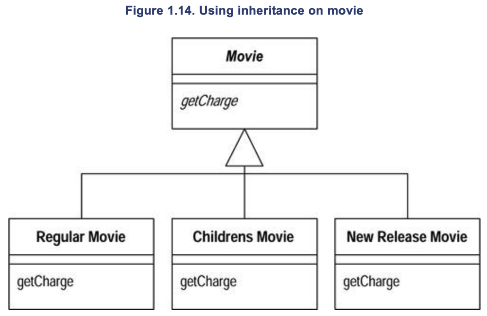
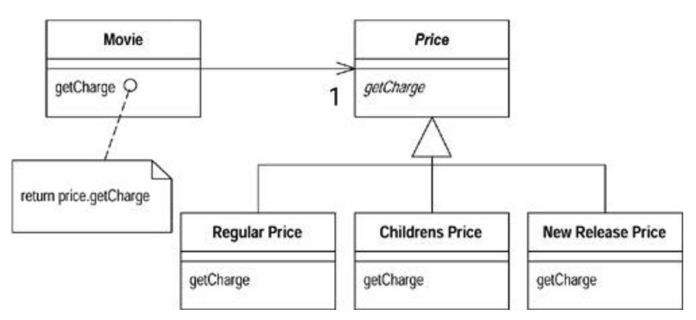

# 리팩토링 Part 1 : 맛보기 예제

### 머릿말

앞서 서적 ‘객체지향의 사실과 오해'와 ‘오브젝트'를 살펴봤다. 이번 서적은 리팩토링이다. 사실 이전 서적들에서 나온 객체지향에서 지켜야할 원칙들이 대거 등장할 것으로 예상된다. 다만 집중하고자 하는 포인트가 조금 다른 것 같다. 

앞선 두 서적에서는 객체지향의 개념과 객체지향이 어떻게 설계되고 움직이는지를 먼저 설명하고 거기에 우리가 잊지 말아야할 원칙들을 소개하는 느낌이라면, 이번 서적에서는 앞서 설명한 원칙들이 제대로 지켜지지 않은 채 설계된 프로그램들에게서 지켜야하는 원칙들을 부활시키는지에 대한 내용인 듯 하다. 이건 굉장히 주관적인 생각이므로 혹시나 틀렸을수도 있다. 잡설이 길었다 시작하자.

---

### 도메인 개념과 클래스 & 클래스 다이어그램

첫 시작은 비디오 대여점에서 고객의 대여로 내역을 계산하고 출력하는 프로그램이다. 필요한 도메인 개념, 클래스와 클래스 다이어그램이다.

1. ***도메인 개념***
    - 프로그램은 비디오 종류와 대여 기간을 토대로 대여로를 계산한다.
    - 비디오 종류는 아래와 같다
        - 일반물
        - 아동물
        - 최신물
    - 대여 내역에 따른 포인트가 지급되는데, 이 포인트는 비디오의 종류가 최신물 여부인지에 따라 다르다
2. 클래스 다이어그램


1. 클래스
    1. Movie : 비디오 데이터 클래스다.
        
        ```java
        public class Movie {
            public static final int CHILDRENS = 2;
            public static final int REGULAR = 0;
            public static final int NEW_RELEASE = 1;
        
            private String _title;
            private int _priceCode;
        
            public Movie(String title, int priceCode) {
                _title = title;
                _priceCode = priceCode;
            }
        
            public int getPriceCode() {
                return _priceCode;
            }
        
            public void setPriceCode(int arg) {
                _priceCode = arg;
            }
        
            public String getTitle() {
                return _title;
            }
        }
        ```
        
    2. Rental : 대여 정보 클래스다.
        
        ```java
        class Rental {
        	 private Movie _movie;
        	 private int _daysRented;
        
        	 public Rental(Movie movie, int daysRented) {
        		 _movie = movie;
        		 _daysRented = daysRented;
        	 }
        
        	 public int getDaysRented() {
        		 return _daysRented;
        	 }
        
        	 public Movie getMovie() {
        		 return _movie;
        	 }
        }
        ```
        
    3. Customer : 고객 클래스다. getter 메서드만 존재하는 1,2번 클래스와는 다르게 이번 클래스에는 내역을 생성하는 statement() 메서드도 존재한다. 
        
        ```java
        class Customer {
            private String _name;
            private Vector _rentals = new Vector();
        
            public Customer(String name) {
                _name = name;
            }
        
            public void addRental(Rental arg) {
                _rentals.addElement(arg);
            }
        
            public String getName() {
                return _name;
            }
        
            public String statement() {
                double totalAmount = 0;
                int frequentRenterPoints = 0;
                Enumeration rentals = _rentals.elements();
                String result = "Rental Record for " + getName() + "\n";
                while (rentals.hasMoreElements()) {
                    double thisAmount = 0;
                    Rental each = (Rental) rentals.nextElement();
                    //determine amounts for each line
                    switch (each.getMovie().getPriceCode()) {
                        case Movie.REGULAR:
                            thisAmount += 2;
                            if (each.getDaysRented() > 2) 16 thisAmount += (each.getDaysRented() - 2) * 1.5;
                            break;
                        case Movie.NEW_RELEASE:
                            thisAmount += each.getDaysRented() * 3;
                            break;
                        case Movie.CHILDRENS:
                            thisAmount += 1.5;
                            if (each.getDaysRented() > 3) thisAmount += (each.getDaysRented() - 3) * 1.5;
                            break;
                    }
                    // add frequent renter points
                    frequentRenterPoints++;
                    // add bonus for a two day new release rental
                    if ((each.getMovie().getPriceCode() == Movie.NEW_RELEASE) && each.getDaysRented() > 1)
                        frequentRenterPoints++;
                    //show figures for this rental
                    result += "\t" + each.getMovie().getTitle() + "\t" + String.valueOf(thisAmount) + "\n";
                    totalAmount += thisAmount;
                }
                //add footer lines
                result += "Amount owed is " + String.valueOf(totalAmount) + "\n";
                result += "You earned " + String.valueOf(frequentRenterPoints) + " frequent renter points";
                return result;
            }
        }
        ```
        

혹시 ‘오브젝트' 서적에서 예시로 나왔던 몬스터 메서드([Part 5 포스팅](https://velog.io/@leeho1110/%EC%98%A4%EB%B8%8C%EC%A0%9D%ED%8A%B8-%EC%BD%94%EB%93%9C%EB%A1%9C-%EC%9D%B4%ED%95%B4%ED%95%98%EB%8A%94-%EA%B0%9D%EC%B2%B4%EC%A7%80%ED%96%A5-%EC%84%A4%EA%B3%84-Part-5))가 기억나는가? 벌써 어지럽다. 우선 본문에서 필자는 엉터리 설계에 아예 객체지향적이지도 않다고 말한다. 하지만 이것은 간단한 프로그램의 축에 속한다. Statement() 메서드의 문제는 아래와 같다. 

1. 너무 많은 기능이 들어가있다.
2. 심지어 들어간 기능조차 다른 클래스에 들어가야하는 기능(책임)이다.
3. 요구사항의 변경에 적은 수정으로 대응할 수 없다. 
    1. 만약 출력 형식을 HTML로 변경하려면 출력 부분만 다른 같은 코드를 재생성해야한다.

이 프로그램은 말할 필요도 없이 리팩토링이 필요하다. 시작해보자. 아 그리고 리팩토링의 첫 단계는 항상 똑같다. 리팩토링을 적용해야할 코드 부분에 대해 신뢰도 높은 테스트를 작성하는 것이다. 인간은 망각의 동물이며 실수의 어머니(?)다. 항상 실수를 방지하기 위해 테스트 코드를 작성하자. 테스트는 4장에서 자세히 다룬다. 우선은 가볍게 리팩토링을 시작해보며 파악해보자.

---

### 리팩토링을 시작해보자 (statement() 메서드 분해와 기능 재분배)

이번 장에서 실시할 리팩토링 중 첫번째는 메서드를 분해해 각 부분을 알맞은 클래스로 옮기는 것이다.  우선은 어떻게 작은 부분으로 쪼갤 수 있을지 살펴보자. 우선 논리적 코드 뭉치를 찾아 메서드 추출(Extract Method) 기법을 사용할 것이다. 이때 우리는 지역변수와 매개변수에 해당하는 부분에서 버그가 발생하지 않도록 살펴봐야 한다. 순서대로 시행해보자.

---

### 영화 종류에 따라 대여료 계산 메소드를 다르게 적용하는 switch문

```java
...
Rental each = (Rental) rentals.nextElement();
//determine amounts for each line
switch (each.getMovie().getPriceCode()) {
    case Movie.REGULAR:
        thisAmount += 2;
        if (each.getDaysRented() > 2) 16 thisAmount += (each.getDaysRented() - 2) * 1.5;
        break;
    case Movie.NEW_RELEASE:
        thisAmount += each.getDaysRented() * 3;
        break;
    case Movie.CHILDRENS:
        thisAmount += 1.5;
        if (each.getDaysRented() > 3) thisAmount += (each.getDaysRented() - 3) * 1.5;
        break;
}
// add frequent renter points
frequentRenterPoints++;
...
```

앞서 메서드 추출에서는 지역변수와 매개변수를 먼저 확인할 필요가 있다고 말했다. 여기서는 each, thisAmount 변수를 주의깊게 보면 된다. each 변수는 변경되지 않지만 thisAmount는 switch 로직 내부에서 변경된다. 변경되지 않는 변수는 매개변수로 전달되어도 상관없지만, 변경되는 경우는 주의해야한다. 만약 변경되는 변수가 하나뿐이라면 그 변수를 반환하여 해결할 수 있다. 아래는 리팩토링 후의 코드다.

```java
...
Rental each = (Rental) rentals.nextElement();
//determine amounts for each line
thisAmount = amountFor(each);
// add frequent renter points
frequentRenterPoints++;
...
```

```java
private double amountFor(Rental aRental) {
		// 필자는 thisAmount의 자료형을 int로 잘못 선언한 부분을 언급하며 테스트의 중요성을 강조
    double result = 0;
    switch (aRental.getMovie().getPriceCode()) {
        case Movie.REGULAR:
            result += 2;
            if (aRental.getDaysRented() > 2)
                result += (aRental.getDaysRented() - 2) * 1.5;
            break;
        case Movie.NEW_RELEASE:
            result += aRental.getDaysRented() * 3;
            break;
        case Movie.CHILDRENS:
            result += 1.5;
            if (aRental.getDaysRented() > 3)
                result += (aRental.getDaysRented() - 3) * 1.5;
            break;
    }
    return result;
}
```

혹시 return문을 통해 변경되는 변수를 반환하는 것 외에 우리는 메서드 인자를 each에서 aRental로, thisAmount를 result로 변수명을 변경했다. 굳이 변수명을 변경한 이유가 있느냐 묻는다면 이렇게 답할 것이다. 좋은 코드는 항상 어떤 기능을 수행하는지 분명히 드러나야 하며, 이를 가능케 하는 열쇠가 바로 직관적인 변수명이다. 

> *컴퓨터가 인식 가능한 코드는 바보라도 작성할 수 있지만, 인간이 이해할 수 있는 코드는 실력 있는 프로그래머만 작성할 수 있다.*
> 

---

### ***대여로 계산 메서드 amountFor()의 원래 자리 찾아주기***

위에서 리팩토링한 amountFor() 메서드를 자세히 들여다보면 자신이 속한 Customer 클래스의 정보는 전혀 이용하지 않고 Rental 클래스의 정보를 이용한다. 자율적인 객체는 항상 상태와 행동이 함께 자리한다는 것을 기억하는가? 객체는 스스로의 상태를 처리하는 자율적인 존재였고, 객체의 책임(시스템의 기능)과 이를 수행하는데 필요한 상태(정보)는 반드시 동일한 객체 안에 존재해야만 했다. 즉 amountFor() 메서드의 원래 자리는 Rental 클래스이다. 이사를 시작하자. 우리가 amountFor() 메서드의 이사를 위해 호출할 이삿짐 센터는 메서드 이동(Move Method) 기법이다. 아래는 이사과 완료된 Rental 클래스와 amountFor() 메서드다.

```java
class Rental {
	...
	double getCharge() {
      double result = 0;
      switch (getMovie().getPriceCode()) {
          case Movie.REGULAR:
              result += 2;
              if (getDaysRented() > 2)
                  result += (getDaysRented() - 2) * 1.5;
              break;
          case Movie.NEW_RELEASE:
              result += getDaysRented() * 3;
              break;
          case Movie.CHILDRENS:
              result += 1.5;
              if (getDaysRented() > 3)
                  result += (getDaysRented() - 3) * 1.5;
              break;
      }
      return result;
  }
}
```

여기서 우린 amountFor()의 메서드명을 기능의 목적을 직관적으로 확인할 수 있도록 getCharge로 변경했으며, Rental 인스턴스를 매개변수로 받던 시그니처도 변경했다. 결과적으로 Customer의 statement() 로직은 아래와 같이 변경된다.

```java
...
Rental each = (Rental) rentals.nextElement();
//determine amounts for each line
thisAmount = each.getCharge();
// add frequent renter points
frequentRenterPoints++;
...
```

추가적으로 리팩토링할 부분이 하나 더 있다. 바로 thisAmount 변수의 불필요한 중복이다. 이 임시변수의 역할은 each.charge() 메서드의 결과를 저장하는 것외에는 필요가 없다. 임시변수를 메서드 호출로 전환 (Replace Temp with Query) 기법을 사용해 임시변수를 삭제하고 메소드 호출로 변환하자. 이 작업을 통해 변경된 코드다

```java
...
Rental each = (Rental) rentals.nextElement();

// thisAmount 변수 삭제
// thisAmount = each.getCharge();

// add frequent renter points
frequentRenterPoints++;
...

//show figures for this rental
result += "\t" + each.getMovie().getTitle()+ "\t" +
String.valueOf(each.getCharge()) + "\n";
totalAmount += each.getCharge();
...
```

이런 임시변수는 불필요하게 많은 매개변수를 전달하게 되는 문제가 자주 생기며, 본래의 목적도 점점 잊혀진다. 이에 따라 성능도 당연히 같이 떨어지게 된다. 만약 이런 임시변수를 애플리케이션 내에서 자주 정의하고 있다면 (나부터) 없애는 습관을 가지자.

---

### ***적립 포인트 계산을 메서드로 추출하기***

아래는 기존 코드다. 기본적으로 적립 포인트를 1만큼 지급하고 만약 최신물을 이틀 이상 대여하는 경우 보너스 포인트 1을 추가 지급하는 프로세스다.

```java
...
// add frequent renter points
frequentRenterPoints++;

// add bonus for a two day new release rental
if ((each.getMovie().getPriceCode() == Movie.NEW_RELEASE) && each.getDaysRented() > 1)
    frequentRenterPoints++;

//show figures for this rental
...
```

이 부분도 each 인스턴스에서 Movie와 가격, 타입, 대여날짜를 getter 메서드를 통해 가져온 뒤 로직을 수행하고 있다. 2번 경우와 마찬가지로 Rental 클래스로 옮기자. 이 때 frequentRenterPoints 변수가 메서드 상단부에 임시 변수로 선언되어있다. 이번에도 2번과 동일한 경우로 내부 로직을 처리한 후 반환해주는 것으로 해결이 가능하다. 아래는 리팩토링을 진행한 결과다.

```java
...
// add frequent renter points
frequentRenterPoints += each.getFrequentRenterPoints();

//show figures for this rental
...
```

```java
class Rental {
		...
    int getFrequentRenterPoints() {
        if ((getMovie().getPriceCode() == Movie.NEW_RELEASE) &&
                getDaysRented() > 1)
            return 2;
        else
            return 1;
    }
		...
}
```

---

### 임시변수 없애기

앞서 말했던 것처럼 임시변수는 다양한 문제가 있엇다. 따라서 statement() 내부에 존재하는 임시변수인 totalAmount, frequenctRentalPoints 변수를 질의 메서드로 변환하자. 

```java
...
// AS-IS
result += "Amount owed is " + String.valueOf(totalAmount) + "\n";
result += "You earned " + String.valueOf(frequentRenterPoints) + " frequent renter points";

// TO-BE
result += "Amount owed is " + String.valueOf(getTotalCharge()) + "\n";
result += "You earned " + String.valueOf(getTotalFrequentRenterPoints()) + " frequent renter points";
...
```

```java
// New query method
private double getTotalCharge() {
    double result = 0;
    Enumeration rentals = _rentals.elements();
    while (rentals.hasMoreElements()) {
        Rental each = (Rental) rentals.nextElement();
        result += each.getCharge();
    }
    return result;
}

private int getTotalFrequentRenterPoints(){
    int result = 0;
    Enumeration rentals = _rentals.elements();
    while (rentals.hasMoreElements()) {
        Rental each = (Rental) rentals.nextElement();
        result += each.getFrequentRenterPoints();
    }
    return result;
}
```

임시변수들을 삭제하고 해당 자리에 질의 메서드를 신규 생성해 교체했다. 하지만 여기서 한가지 이상한 점이 있다. 우리는 리팩토링을 진행했지만 오히려 코드의 라인이 증가했으며 심지어 성능이 오히려 저하됐다. 과연 리팩토링이 맞는 절차였을까? 사실 대부분의 경우는 이 리팩토링은 반대할 것이지만 필자는 이렇게 말한다. 지금 겪는 성능의 문제는 최적화 단계에서 걱정해도 늦지 않다고 말이다. 

---

### 새로운 요구사항의 등장

리팩토링을 완료하기에 천재일우의 기회라고 생각했건만 대여점의 비디오 분류를 변경하고 싶다는 추가 요청사항이 들어왔다. 현업에 계신 분들은 이 아픔을 공감하실 것이다. 매일 잊어버리는 우산보다 요구사항이 더 많이 바뀐다는 것을. 자 비디오 분류를 바꾸려면 비디오 분류마다 매핑되어있는 대여료와 포인트 적립 비율도 변경해야 한다. 하지만 당장은 이것이 힘들기 때문에 대여료를 계산하는 메서드와 포인트를 분류에 따라 적립해주는 메서드의 리팩터링부터 마무리하자.

---

### 가격 책정 부분의 조건문을 재정의로 교체

또 다시 switch문이다. 이전의 switch문은 Moive의 priceCode를 인자로 사용하고 있었다. 이 방법은 타 객체의 정보가 아닌 자신의 정보를 사용하는 것이 옳다. 이것은 Switch문의 위치가 비교하는 정보가 있는 곳으로 옮겨지는 것이 맞다는 의미다. Rental.getCharge() 메서드를 Movie 클래스로 옮겨보자. 이 때 Rental 클래스에서 사용하던 정보인 daysRented를 매개변수로 전달받도록 수정했다. 그런데 결과적으로 살펴보면 getCharget() 메서드는 Rental, Movie 클래스의 정보를 둘다 사용한다. 그런데 왜 굳이 Movie로 옮긴 것일까? 바로 요구사항이 ‘비디오 분류의 추가' 였기 때문이었다. 비디오 분류는 Movie의 인스턴스 변수로 선언되어있고 이는 추후 변경될 가능성이 높기 때문에 대여로 계산 메서드를 Movie 클래스로 옮긴 것이다. 다음은 완료된 리팩토링 부분이다.

```java
class Movie {
	...
	double getCharge(int daysRented) {
      double result = 0;
      switch (getPriceCode()) {
          case Movie.REGULAR:
              result += 2;
              if (daysRented > 2) result += (daysRented - 2) * 1.5;
              break;
          case Movie.NEW_RELEASE:
              result += daysRented * 3;
              break;
          case Movie.CHILDRENS:
              result += 1.5;
              if (daysRented > 3) result += (daysRented - 3) * 1.5;
              break;
      }
      return result;
  }
}
```

```java
class Rental {
	...
	double getCharge() {
		// 메서드 구현은 Movie로 옮기고 기존 로직은 Movie 클래스의 메서드를 호출하도록 수정
		return _movie.getCharget(_daysRentend);
	}
}
```

마찬가지로 getFrequentRenterPoints()도 Movie 클래스로 옮겨보자. 

```java
class Movie {
	...
	int getFrequentRenterPoints(int daysRented) {
  if ((getPriceCode() == Movie.NEW_RELEASE) && daysRented > 1)
      return 2;
  else
      return 1;
  }
}
---
class Rental {
	...
	double getFrequentRenterPoints() {
		// 메서드 구현은 Movie로 옮기고 기존 로직은 Movie 클래스의 메서드를 호출하도록 수정
		return _movie.getFrequentRenterPoints(_daysRentend);
	}
}
```

이렇게 적립 포인트 계산 메서드까지 옮기고 나면 비디오 종류마다 달라지는 대여료와 적립 포인트 계산 로직이 비디오 분류가 든 클래스에서 처리되어 변경에 대한 파급효과를 다른 클래스가 받지 않아도 된다. 

---

### 마지막 단계, 상속 구조 만들기

현재 Movie 클래스는 대여료를 계산하기 위해 getCharge() 메서드를 호출하더라도 내부 구현때문에 비디오 구분에 따라 다른 결과값을 반환한다. 그런데 잘 생각해보면 이 일은 세부(하위) 클래스가 직접해야하는 내용이다. 따라서 Movie 클래스를 상속받는 3개의 하위 클래스를 새로 작성해 getCharge()를 재정의하는 것이 합리적이다. 이를 따라 변경된 클래스 구조는 아래와 같다. 하지만 여기엔 한가지 문제점이 발생한다. 바로 Movie가 갖는 구분값은 변경이 가능하지만 객체는 그렇지 않다는 것이다. 이게 어떤 문제인지 예제를 통해 확인해보자.



```java
public class VideoRental {
	public static void main(String[] args) {
		// Initialize
		Customer leeho = new Customer("이호");
		/* 
		AS-IS: Movie constantin = new Movie("콘스탄틴"); // switch문에 따른 대여료 계산
		TO-BE: Movie constantin = new NewReloeaseMovie("콘스탄틴"); // getCharge()를 재정의한 구현대로 대여료 계산
		*/
		Rental rental = new Rental(constantin, 3);
		leeho.addRental(rental);

		System.out.println(leeho.statement());
	}
}
```

위 로직은 leeho는 최신물 영화 constatin을 빌리고 그 내역을 출력한다. 만약 기존 설계라면 getCharge()가 호출될 때 switch문에서 알맞는 로직을 선택해 수행한다. 반면 getCharge() 메서드가 Movie를 상속하는 하위 클래스에 재정의되어있다면 switch문 자리에는 각 하위 클래스에 특화된 유일한 로직을 실행할 것이다. 즉 TO-BE 형태로 Movie 인스턴스가 생성되게 되면 구분값(상태)는 변경이 가능하지만 객체는 변경이 되지 않는 둘 사이의 불일치가 발생하게 된다. 우리는 하위 클래스를 재정의하는 것 대신 이를 [상태 패턴](https://victorydntmd.tistory.com/294)을 적용해 해결할 수 있다.

---

### 상태 패턴 적용시키기

상태 패턴의 핵심은 객체의 행위가 상태에 따라 변경되는 경우, 객체가 행동하지 않고 객체화된 상태가 행동하도록 하는 것이다. 이해하기 힘들다면 **행위에 대한 책임을 자신에서 상태에게로 위임**하는 것이라고 이해하면 쉬울 듯 하다. 위 과정을 통해 행위(대여료 계산)를 처리하는 역할을 상태로 바꾸고, Movie는 priceCode에 값에 따른 처리를 수행하는 상태 구현 클래스만 주입해주는 형태로 변경된다. 말로 설명하려니 힘드니 코드로 직접 보자. 우선 우리는 앞서 언급한 상태가 무엇인지를 먼저 정의해야 한다. 생각해보자 대여로 계산 메서드는 어떤 것에 따라 계산 로직이 바뀌는가. 바로 Movie의 priceCode이다. 우리는 priceCode를 객체화시키면 된다. 아래는 Movie클래스에 상태 패턴을 적용시켜 priceCode를 객체화시킨 클래스 다이어그램이다. 



위 구조를 적용시키기 위해서 우리는 세 가지 리팩토링 기법을 사용할 것이다. 첫번째로 위에서 말한 priceCode를 ‘상태/전략 패턴으로 전환(Replace Type Code with State/Strategy)’ 기법을 실시해 분류 부호의 기능을 상태 패턴 안으로 옮기자. 그 다음 메서드 이동 기법으로 switch문을 Price 클래스 안으로 옮기고, ‘조건문을 재정의로 전환(Replace Conditional with Polymorphism) 기법으로' switch문을 삭제시키면 끝이다. 시작하자.

1. **분류 부호의 기능을 상태 패턴 안으로 옮기기**
    
    여기서 첫번째로 해야할 일은 필드 캡슐화다. 객체가 필드에 직접 접근하는 것이 아닌 getter,setter를 통해서만 접근하도록 변경해야한다. 생성자에 있는 초기화 부분을 setter 메서드로 대체하자. 
    
    ```java
    class Movie {
    	...
    	private int _priceCode;
    	...
    	public Movie(String name, int priceCode){
    		_name = name;
    		/*
    		AS-IS: _priceCode = priceCode;
    		TO-BE: _priceCode = setPriceCode(priceCode);
    		*/
    	}
    	public void setPriceCode(int arg){
            switch(arg){
                case REGULAR:
                    _price = new RegularPrice();
                    break;
                case CHILDRENS:
                    _price = new ChildrensPrice();
                    break;
                case NEW_RELEASE:
                    _price = new NewReleasePrice();
                    break;
                default:
                    throw new IllegalArgumentException("Incorrect Price Code");
            }
        }
    }
    ```
    
    다음 Price 클래스를 상속 확장하는 클래스를 작성하고 각 하위 클래스에 자신의 priceCode를 리턴하는 getter 메서드를 구현하자. 
    
    ```java
    abstract class Price {
        abstract int getPriceCode();
    }
    class ChildrensPrice extends Price {
        int getPriceCode() {
            return Movie.CHILDRENS;
        }
    }
    class NewReleasePrice extends Price {
        int getPriceCode() {
            return Movie.NEW_RELEASE;
        }
    }
    class RegularPrice extends Price {
        int getPriceCode() {
            return Movie.REGULAR;
        }
    }
    ```
    
    지금 작성한 코드를 통해 우리는 Movie의 상태(priceCode)를 객체화시켰다. 이제 Movie의 priceCode는 1,2,3 값이 아닌 ChildrensPrice, NewReleasePrice, RegularPrice 객체로 대체될 것이다. 자 그러면 이제 대여료 계산에 대한 책임을 Movie에서 Price에게로 위임할 차례다. 지금은 임시로 Price로 옮겨놓고, 서브 클래스로 각각 나눌 예정이다. 안심하자.
    
    ```java
    class Movie {
    		...
    		double getCharge(int daysRented) {
    				// AS-IS swtich문
    				return _price.getCharge(daysRented);
    		}
    }
    
    class Price {
    		...
    		double getCharge(int daysRented) {
            double result = 0;
            switch (getPriceCode()) {
                case Movie.REGULAR:
                    result += 2;
                    if (daysRented > 2)
                        result += (daysRented - 2) * 1.5;
                    break;
                case Movie.NEW_RELEASE:
                    result += daysRented * 3;
                    break;
                case Movie.CHILDRENS:
                    result += 1.5;
                    if (daysRented > 3)
                        result += (daysRented - 3) * 1.5;
                    break;
            }
            return result;
        }
    }
    ```
    
    위 작업을 통해 Movie는 대여료 계산을 수행해야하는 책임을 Price 객체에게 토스하고 있다. 위에서 우린 Price의 상속 클래스를 추가해 각 하위 클래스들이 대여료 계산을 수행하도록 했다. switch문의 내부 구현을 각각의 하위 클래스가 책임질 수 있도록 수정해보자.
    
    ```java
    class Price {
    	...
    	abstract double getCharge(int daysRentesd);
    }
    
    class RegularPrice {
    		...
    		@Override
    		double getCharge(int daysRented){
            double result = 2;
            if (daysRented > 2)
                result += (daysRented - 2) * 1.5;
            return result;
        }
    }
    
    class ChildrenPrice {
    		...
    		@Override
    		double getCharge(int daysRented){
            double result = 1.5;
            if (daysRented > 3)
                result += (daysRented - 3) * 1.5;
            return result;
        }
    }
    
    class NewRealeasePrice {
    		...
    		@Override
    		double getCharge(int daysRented){
            return daysRented * 3;
        }
    }
    ```
    
    완료했다. 본문에선 getFrequentRenterPoints() 메서드도 같은 방식으로 리팩토링하지만 해당 부분은 생략하겠다. 마지막으로 비디오 대여 시스템 예제에서 우리가 발견한 문제점들과 리팩토링을 다시 한번 되돌아보자.
    
---
    
### 정리
    
1장에서는 비디오 대여 시스템을 예제로 리팩토링을 해야하는 상황과 리팩토링 기법들을 가볍게 파악해봤다. 우선 v1에서는 Customer 클래스에 존재하는 몬스터 메서드가 존재했다. 이 메서드는 지나치게 많은 기능을 들어있었고, 들어있는 기능조차 원래는 다른 클래스에 있어야 하는 기능들이었다. 또한 출력 기능같은 메서드 내부의 기능에 대한 요구사항을 변경하고 싶을 때에도 메서드 내부가 적절하게 분리되어 있지 않았기 때문에 유연한 변경도 불가능하다. 따라서 우리는 위 문제를 해결하기 위해 N가지의 리팩토링을 수행했다. 수행했던 리팩토링들을 살펴보자.
    
    1. **비디오 종류별 대여료 계산 메서드 추출**
        
        Movie 클래스의 priceCode별로 대여료를 계산하는 switch문을 별도의 메서드로 추출하고 변수명을 직관적으로 수정했다.
        
    2. **대여료 계산 메서드의 자리 찾기**
        
        앞서 옮긴 메서드는 Rental 클래스의 정보를 사용하고 있었지만 Customer 클래스에 들어있었다. 따라서 이를 Rental 클래스로 옮겨 상태와 행동이 같은 클래스에 위치하도록 변경했다. 
        
    3. **적립 포인트 계산 로직을 메서드로 추출**
        
        적립금 로직과 최신물을 이틀 이상 대여한 경우 추가 포인트를 지급해주는 로직을 메서드로 추출했다.
        
    4. **임시 변수 없애기**
        
        statement() 메서드에서는 2개의 임시변수가 존재했다. 존재변수는 코드의 복잡성을 유발하기 때문에 이를 질의 메서드를 새로 생성해 대체했다.
        
    5. **가격 책정 부분의 조건문을 재정의로 교체**
        
        비디오 분류를 추가하고 싶다는 새로운 요구사항이 들어왔다. 따라서 이를 유연하게 반영하기 위해 비디오 분류별 대여료 계산 메서드를 Movie로 이동시키고 Rental에서 이를 호출하도록 변경했다. 
        
    6. **상속 구조 만들기**
        
        마지막이었다. 대여료 계산 메서드를 Movie 객체로 옮기긴 했지만, 해당 메서드는 Movie의 priceCode에 따라 수행해야하는 로직(내부 구현)이 변경되어야 했다. 하지만 이는 Movie 클래스에 뭉쳐있는 문제가 있었다. 따라서 이를 상태 패턴을 적용시켜 Movie가 아닌 상태 객체가 행동에 대한 책임을 수행하도록 변경했다. 
        
    
---
    
### 맺음말
    
맛보기 예제를 통해 리팩토링이 필요한 상황과 간단한 리팩토링 작업을 수행했다. 그리고 리팩토링을 진행하며 느꼈던건 결국 리팩토링이라는 작업도 객체의 책임이 적절하게 나눠져 있지 않은 객체들을 객체지향적으로 변경해주는 작업이라는 것이다. 이번 장에서는 개념보다는 직접 리팩토링을 진행해보며 리팩토링이 무엇이고 어떤 기법들을 사용할 수 있는지를 가볍게 확인했다. 다음장에서는 리팩토링의 원리와 지켜야할 사항에 대해 확인해보자.