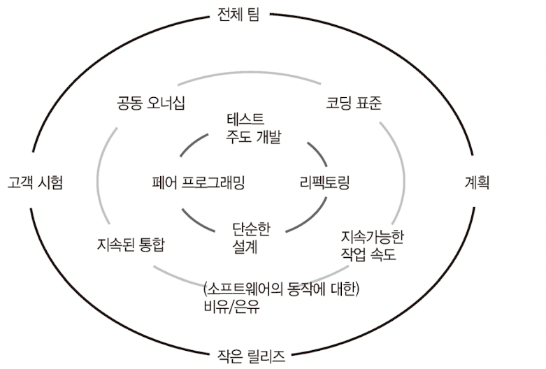

# 소프트웨어 장인 - 산드로 만쿠소

### 1장: 21세기의 소프트웨어 개발

- 소프트웨어 개발자가 소프트웨어 개발 업무만 하면 되던 시절은 지나갔다. 코딩과 관련된 것이 아니면 개발자와 상관없는 문제라는 태도는 이젠 용납되지 않는다.
    - 소프트웨어 개발자는 이제 코딩만 하는 사람이 아니다. 제품을 고객 입장에서 생각하고 발전시키는 능동적이고 프로페셔널한 자세가 매우 중요하다.

---

### 2장: 애자일

- 절차적인 관점에서의 애자일 원칙과 기술적인 관점에서의 애자일 원칙은 다르다.
    - 절차적인 관점에서는 아래와 같은 사항을 규정한다. 이러한 방법론들을 통해 팀에게 정말 중요한 것인 비**즈니스 가치가 있는 것에 집중**하며, **올바른 방향으로 나아가고 있는지**를 확인할 수 있다.
        - 회의 방식
        - 구성원 각각의 역할
        - 요구사항 파악 방법
        - 작업 진척 속도 파악 방법
        - 점진적/반복적으로 일할 때 취하는 방식
        - 진행 상황을 개발팀 밖의 관계자(고객/영업 등)에게 전달하는 방식
        - 비즈니스 피드백 방식
    - 반면 기술적인 것인들은 좀더 세부적인 TDD, 페어 프로그래밍, CI/CD 같은 것들이다. 이러한 기술적 원칙들은 **목표한 것(결과물)을 실행하고 있는지(만들어 가는지)**를 확인한다.
- 뭐든 본질을 잊지 않는 것이 중요하다. 애자일을 하기 위해 애자일하는 것이 아니다.
    - 애자일을 도입해 절차를 뒤바꾸는 모든 궁극적인 목적은 소프트웨어에 대한 투자 대비 이득을 키우기 위해서다. 그 목적을 달성하지 못하면 이 노력들은 모두 허사다.
- 절차의 개선에는 모든 단계마다 피드백이 존재한다는 전제가 필요하다.
    - 그리고 이 피드백 시스템이 동작하기 위해선 자기가 하는 일에 충분히 주의를 기울이고 뭔가 잘못되고 있거나 더 나은 방법이 있다고 느낄 때 자기 목소리를 내는 재능 있고 프로페셔널한 사람들이 있어야 한다.
- 항상 실패한 폭포수 방식 개발 프로젝트들이 갖는 특성들이 있었다. 최종 테스트 단계의 진행 기간이 개발을 포함한 선행 단계 전체를 합한 것보다 훨씬 오래 걸리는 것이었는데
    - 그런 케이스에서 프로젝트는 실제 사용자와 커뮤니케이션 하지 못했고
    - 비즈니스 담당자와 칸막이가 쳐져 있었으며
    - 빠르게 빈번한 피드백 루프도 없었다.
- 애자일은 조직과 비즈니스에 새로운 사고방식을 제공한다.
    - 애자일 방법론들은 가치에 따라서 일을 이해하고 우선순위를 정하며
    - 관료주의와 낭비를 줄이고, 사람들에게 권한이양과 동기부여를 하며
    - 이를 통한 피드백 루프를 만들어준다.
    - 이것이 기업의 반응속도를 높이고 기민하게 하며, 기업이 올바른 일을 하도록 돕는 것이다
    
    → *계속 느끼지만 효율성을 극대화시키고 쓸데없는 정치와 관료주의를 탈피하는 것이 애자일의 방향이다. 그런데 대부분의 기업들은 시간이 지날수록 이런 요소들이 많아진다. 깨어있어야 한다.* 
    
    → ‘*원래 그랬어’라고 치부되는 것들은 사실 원래 그러지 않았다. 비틀어진 시선과 본인의 부족함을 인정하지 않은 채 아무런 의미없이 보낸 시간을 자신이 가진 가치이자 무기라고 생각하는 일부 때문에 조직은 망가진다.*
    

---

### 3장: 소프트웨어 장인정신

- 소프트웨어 장인정신은 소프트웨어 개발자가 스스로가 선택한 커리어에 책임감을 가지고, 지속적으로 새로운 도구와 기술을 익히며 발전하겠다는 마음가짐이다.
    - 소프트웨어 장인정신은 책임감, 프로페셔널리즘, 실용주의 그리고 소프트웨어 개발자로서의 자부심을 의미한다.
- 동작하는 소프트웨어라고 해서 잘 만들어진 애플리케이션이라고 할 수 있을까?
    - 좋은 소프트웨어는 부작용도 알려져 있고, 관리도 가능해야 한다.
    - 높은 커버리지와 신뢰할 수 있는 테스트가 존재해야 해며
    - 명료하고 단순한 디자인 그리고 비즈니스 용어로 잘 기술된 코드여야 한다.
- 애플리케이션의 수명을 오래 유지시키려면 소프트웨어의 품질에 최우선적으로 집중해야 한다.
- 기업과 소프트웨어 사이에서 생산적 동반자 관계는 무척 중요하다. 이런 기업들은 소프트웨어 개발을 공장 라인의 한 단계로 본다. 마치 우리 회사 같군.
    - 이러한 기업들 중 일부는 그들이 찾을 수 있는 가장 값싼 개발자를 고용하는 데에 집중한다.
- 소프트웨어 장인정신을 마지막으로 정리해보자면 소프트웨어 개발자의 프로페셔널리즘이다. 항상 최선을 다하며 고객에게 좋은 서비스를 제공하려는 개발자는 자연스럽게 장인 정신을 지니고 상태다.

---

### 4장: 소프트웨어 장인의 태도

> *오래 전 작성했던 코드를 지금에 와서도 고칠 부분이 없어 보인다면, 그것은 그동안 배운 것이 없다는 뜻이다.*
> 
- 앞서 소프트웨어 장인 정신은 소프트웨어 개발자의 프로페셔널리즘이라고 말했다. 우리가 만약 소프트웨어 프로페셔널로 대우받기를 원한다면 당연히 프로처럼 행동해야 한다.
    - 이는 스스로를 발전시키는 데 자신의 돈과 시간을 들여야 한다는 것이다.
    - 필자는 불만을 표하는 동료에게 이렇게 말했다고 한다.
        
        ***“네 커리어와 프로페셔널로서의 미래는 누구의 책임인가?”***
        
- 커리어의 주인은 나다. 물론 기업이 직원 교육을 전혀 하지 않아도 된다는 의미가 아니다. 이는 고용주의 책임의 의무가 아니라 호의다. 영화 ‘~~부당거래’의 명대사(“호의가 계속되면 둘리가 된다는”)가 생각난다.~~
    - 열정적인 개발자라면 항상 그러한 배려를 제공하는 기업을 일자리로 선택할 것이다.
- 본문에서 저자는 끊임없는 자기계발을 위해 여러 가지 도구를 제안한다.
    - 독서
        - 기술 서적: 프레임워크, 언어, 소프트웨어의 이용 방법을 다루는 서적이다.
            
            ex. Java, Hibernate, Node.js
            
        - 개념 서적: 새로운 개념이나 패러다임, 실행 관례들을 다루는 서적이다.
            
            ex. TDD, 도메인 기반 개발, 객체 지향 설계 등
            
        - 행동양식: 효율적으로 팀에서 일할 수 있는 방법, 더 나은 프로페셔널이 될 수 있는 방법, 사람들을 어떻게 대하고 일정을 어떻게 관리해야 하는지
            
            ex. 애자일 방법론, 소프트웨어 장인정신, 린 소프트웨어 개발
            
        - 혁명적 서적: 어떤 개념이나 행동양식을 다룬 책들이다.
            
            ex. 실용주의 프로그래머, 디자인 패턴, 테스트 주도 개발, 익스트림 프로그래밍, 클린 코더, 소프트웨어 장인정신, 리팩토링
            
    - 블로그
        - 블로그는 우리의 배움과 자기계발에 대한 기록의 장으로 두는게 좋다.
    - 팔로우할 리더를 찾는 것.
        - 리더 그룹의 행보를 뒤쫒자. 개인적으로는 주변 회사 동료에게서도 찾을 수 있다고 본다. 그런 분들이 많은 기업에 가는 것이 세 번째 방법의 성공 가능성을 높힐 수 있는 방법이라고 생각한다.
    - 카타
        - 이는 작은 훈련용 코드로, 카타를 통해 우리는 익숙하지 못한 새로운 테크닉이나 기술에 능숙해질 수 있다.
        - 개인적으로 개념 공부를 하면서 코드를 실제로 생각보다 많이 치지 않는 듯 하다. 항상 글보다는 코드와 손가락이 기억할 수 있도록 노력하자.
    - 페어 프로그래밍
        - 스스로에게만 의존하면 자신만의 좁고 편향된 생각에서 벗어날 방법이 없다.
    - 사회활동: 다른 개발자들과 어울리기
        - 아이디어를 주고 받고, 페어 프로그래밍을 하고, 사회적으로 교류할 수 있는 인적 네트워크를 형성하는 것이 성공적인 커리어를 위해 상당히 중요하다.
    - 의도한 발견
        - 자신이 모르는 것을 모른다고 받아들이자. 소크라테스는 이런 말을 했다.
            
            > ***“나는 아테네에서 가장 똑똑한 사람임에 틀림없다. 
            왜냐하면 나는 내가 아무것도 모른다는 사실을 알았기 떄문이다.”***
            > 
        - 항상 ‘무지'라는 장애요소를 빠르게 제거하다. 항상 우선순위에 높게 위치시키고 이를 시간이 허용하는 한 빠르게 치워나가는 것은 꼭 프로젝트를 효율적으로 수행하기 위해 꼭 필요한 일이다.
        - 언제나 항상 절대 무지를 목도하지 말아라. 무지에 대항하라.
            
            > ***Do not  go gentle into that good night,
            Old age should burn and rave at close of day.
            Rage, rage against the dying of the light
            
            Do not go gentle into that good night  - Dylan Thomas***
            > 
- 시간이 없다는 말은 더 이상 변명이 될 수 없다. 우리는 항상 시간이 있다. 우리는 모두 정확히 같은 시간이 주어진다. 차이점은 우리가 그 시간을 어떻게 쓰느냐일 뿐이다.

---

### 5장: 영웅, 선의 그리고 프로페셔널리즘

- “아니오"라고 말하는 방법 배우기
    - 우리는 때때로(아니 항상일지도?) 빠듯한 일정과 압박 속에서 프로젝트를 진행한다. 그리고 대부분은 비현실적인 일정이다.
    - 그리고 보통 상급 관리자들은 계약 기간 내에 프로젝트를 끝내려는 욕심에 의도적으로 무리하게 일정표를 만들어 개발자들을 밀어 붙인다.
    - 그리고 젊은 개발자들은 무리한 요구에 굴복하고 일정 안에 해보겠다는 약속을 한다.
- 우리는 영웅이 될 수 있다는 망상에 사로잡혀 프로페셔널하게 행동하지 못한다. 우리는 ‘아니오'라고 말할 수 있어야 한다.
- 물론 항상 “아니오"라고만 말해선 안된다. 항상 대안책을 준비해야 한다.

---

### 6장: 동작하는 소프트웨어

> *프로그래밍은 집을 짓는다기보다는 정원을 돌보는 것에 더 가깝다.

- ‘실용주의 프로그래머’ 인용*
> 
- 코드는 유기물이며, 지속적인 관리에 의해서 상태가 좋아진다. 정기적으로 살피지 않으면 오염된 토양처럼 아무것도 자랄 수 없는 죽음의 땅이 되어버린다.
- 이전 내용과 연관되는 것으로 나쁜 코드를 다루어야 하는 기업은 경쟁력이 떨어진다.
    - 왜? 나쁜 코드는 빠르게 치고 나아가야 하는 기업의 발목을 잡는다. 그리고 개발자 외에는 보이지도 않는다.
- 기술적 부채를 줄이는 것은 기존의 더러운 것을 청소하는 것이다. 이미 깨끗한 상태를 더렵혀서는 안된다. 어떤 상황이든 추가 코드로 인해 기술적인 부채가 더해져서는 안된다.
- QA 팀에서 소프트웨어의 버그를 발견한 것은 대단히 수치스러운 일이다. 어떤 버그들은 요구사항 때문에 발생하기도 하지만, 이것 역시 개발자의 잘못이 포함된다.
    - 프로페셔널한 자세로 비즈니스 분석 담당이나 제품 오너가 문제의 요구사항을 명확히 할 수 있도록 도왔어야 했다.
- 사실 레거시에서 일하고 싶어하는 사람은 거의 없다. 그린필드 프로젝트는 모두가 선호한다. 하지만 아무리 한탄하고 불평하고 저주해봤자 나아지는 건 없다. 무언가 나아지길 원한다면 그에 맞는 행동을 취해야 한다.
    
    > ***무언가가 마음에 들지 않으면 바꾸어라. 그것을 바꿀 수 없다면, 그에 대한 당신의 생각을 바꾸어라.
    
    - 마리 엥겔브레이트***
    > 
    - 레거시를 다룰 땐 거대한 퍼즐을 맞추듯 행동하라. 모든 퍼즐 조각들을 한꺼번에 펼쳐놓고 맞추려 들면 진도가 나가지 않는다.
    - 각 조각을 그룹으로 나누고 모서리나 경계선부터 시작해야 한다.
    - 우리는 두 가지 관점 중 하나를 선택할 수 있다. 하나는 지금 하고 있는 일을 고통스러운 전생의 업보로 보는 것이고 다른 하나는 재미있고 도전적인 문제로 바라보는 것이다.

---

### 7장: 기술적 실행 관례

- 기술적 실행 관례를 도입하는 것이 어떤 비즈니스적 가치를 갖고 있는지 어떻게 증명할까
    - 프로젝트 관리자나 제품 오너에게 왜 이것들이 필요한지 가치를 전달해보자.
- 항상 모든 상황에서 실행 관례들을 도입할 수 있을 거라고는 믿지 않는다. 각자의 사정이 있으니까. 그래도 우리는 우리가 어떤 상황에 놓여 있는지 파악해야 한다.
- XP 실행 관례들은 소프트웨어의 품질과 일이 적절하게 제대로 수행되고 있는지에 대한 관점에서 피드백 루프를 단축시킬 수 있는 여러 방법들을 제공한다.
    - 물론 착각하지 말아야 할 것이 또 하나 있다면 실행 관례를 도입한다고 해서 안되던 일이 막 돌아가는 것이 아니다.
    - 본질적으로 이것이 어떤 것을 위함인가를 깨닫고 몸에 배인 습관처럼 반복했을 때 의도하지 않아도 자연스럽게 나오게 된다.
- 그리고 가장 중요한 것 하나는 실행 관례가 효율적이려면 반드시 모든 팀 구성원들에 의해서 그 가치가 납득되어야 한다.
    - 예를 들어 모든 팀 구성원들은 원활한 정보 소통, 빠른 피드백, 빠른 결과물 생성, 실수 예방, 고객 만족, 최선을 다하지 못하거나 배우지 못하는 것에 대한 부끄러움을 느낄 줄 아는 것, 이런 것들에 가치를 느꺼ㅕ야 한다.
    - 그리고 그것을 증명하는 것은 행동이다. 그리고 이를 증명하기 위한 행동은 기술을 파는 것이 아니다.
    - 현재의 방식과 비교해 얻을 수 있는 이익들을 제시해야 한다.
- 아래는 XP실행 관례다.
    
    

    
    - 이 중 리팩토링에 관한 사실 하나가 있다. 몇 년 동안 바뀐적이 없는 부분을 리팩토링하는 것은 의미가 없다. 애당초 코드를 수정할 필요가 없다면, 리팩토링해야 할 이유도 없다. 리팩토링은 더 자주 변경되는 부분을 대상으로 시작해야 한다.
    - 보이스카웃 규칙(처음 왔을 때보다 더 깨끗하게 하고 떠나라)은 모든 것이 아니라 해당 부분을 이해하여 변경할 필요가 있을 때 적용해야 한다.
- 실용주의는 소프트웨어 장인이 가져야 하는 최선의 역량 중 하나다. 누군가가 이야기했기 떄문에, 또는 그 실행 관례 도입을 위한 도입을 해서는 안된다.
    - 우리는 지속적으로 일하는 더나은 방법을 찾고 고객을 만족시켜야 한다.
- 무언가를 절대적인 진리로 바라보지 마라. 항상 우리가 무엇을 하고 있고 왜 하고 있는지를 질문해야 한다.

---

### 8장: 길고 긴 여정

- 돈은 충족되어야 할 기본 조건이고, 지식 노동자를 움직이는 것은 자율성, 통달, 목적의식 이렇게 세 가지라고 이야기하고 있다.
    - 자율성: 우리가 무엇을 어떻게 언제할지 통제할 수 있는지
    - 통달: 더 나은 프로페셔널, 더 나은 인간이 되기 위해 계속 배우고 진화하는지
    - 목적의식: 지금 하는 일이 중요하고 무언가를 더 나아지게 하고 있다고 느끼는지

---

### 10장: 소프트웨어 장인 면접하기

- 성숙한 채용 문화의 회사라면 단순히 고용자, 피고용자 관계가 아닌 파트너쉽을 기대한다.
    - 우리가 하는 일에 대해서 여러 관점의 질문들을 던지고, 일하는 방식을 개선하여 목표를 성공적으로 달성하는데 기여하기를 원한다.
    - 어떤 식으로 일하는지, 무엇을 성취하길 원하는지, 당면한 문제가 무엇인지에 대해 질문하지 않은 사람이 실제 현장에서 갑자기 돌변할 가능성이 있을까?
- 질문을 많이 하는 지원자는 최소한 지원자 스스로 즐겁게 일할 수 있는 곳을 찾고 있다는 증거가 될 수 있다.
    - 지원자가 과거 수행한 프로젝트나 업무, 기술, 또는 스스로 성취한 사항들을 이야기할 때 얼마나 열정적이고 애착을 보이는가?
    - 실패 사례에 대해서 어떻게 표현하는가?
    - 실패에 대해서 책임감을 느끼는가 아니면 남탓을 하는가?
    - 잘못된 상황을 정상으로 되돌리기 위해 무엇이든 노력해본 적이 있는가?
    - 이전 업무에서 불평 불만 대신 그 상황을 개선하기 위해 스스로 노력한 적이 있는가?
    - 어떤 종류의 업무 환경을 찾고 있는가? 찾고 있는 환경을 회사가 제공해줄 수 있는가?
- 지원자는 면접이 자신이 같이 일할 사람들에 대해 알 수 있는 중요한 기회다.
    - 관리층이 개발자들을 신뢰하는지
    - 여러 측면을 보고자 하는지

---

### 12장: 낮은 사기의 대가

- 애자일로 전환하고자 하는 회사들은 많다. 하지만 전환하고 몇년 후 예외없이 제품 개발 역량이 뒤떨어진다는 것을 발견했다. 이를 애자일 행오버라고 한다.
    - 공통적인 문제는 사기 저하다.
- 애자일을 도입한다는 것은 실무자들에 대한 권한 위임, 변화에 대한 내재화, 협업 증대, 정말로 중요한 것들에 대한 집중, 각 업무들의 가치 이해, 맹목적인 업무의 배제를 시행한다는 것과 같은 으미다.
- 애자일스럽게 일한다는 것은 일을 올바르게 하고, 소통을 원활히 하고, 피드백 주기를 짧게 하고, 팀워크를 최대화한다는 것과 같아야만 한다.
    - 즉 자율성과 목적의식을 제공할 수 있어야 한다.
- 많은 회사들이 일하는 방식을 개선하지 못하는 이유는 바로 동기가 낮기 때문이다.
    - 구성원들이 동기 부여가 되어 있지 않고 그들의 일이 어떻게 되든 상관하지 않으면 조직을 변화시킬 방법이 없다.
    - 구성원들에게 새로운 방식으로 일하기를 설득하기 전에 다음의 것들을 먼저 생각해보아야 한다.
        - 일을 제대로 할만한 동기 부여가 되어 있는가?
        - 스스로의 일을 개선하는 데 진정 관심을 가지고 있는가?
        - 일을 더 잘 할 수 있도록 지속적으로 자기계발을 하고 있는가?
        - 회사가 하는 일이 사회에 기여하고, 해야 할 가치가 있다고 느끼고 있는가?
- 명심하자. 직원들의 사기가 낮으면 회사가 파괴되기 쉽다.
    - 동기부여가 되지 않는 사람들은 혁신을 창조하고 적용할 에너지가 없다. 일을 제대로 하고 책임을 지는 데에도 관심이 없다.
    - 그 사람들이 원래 그랬던 것은 아니다. 상황이 그렇게 만들어 간다.
    - 개발팀에 열정을 불어넣고 동기를 부여하고 싶다면 소프트웨어 장인 몇 명을 팀에 영입해야 한다.

---

### 13장: 배움의 문화

- 사람들에게 새로운 절차나 새로운 실행 관례를 강제한다고 조직을 변화시킬 수는 없으며 우리는 배움의 문화를 만들어 내야 한다.
    - 사람들 스스로 모든 것을 더 나아지게 하고 싶어하는 동기를 부여할 수 있어야 한다.
    - 배움의 문화는 회사에 효율적으로 열정을 주입할 수 있다.
- 만약 아무도 참여하려 하지 않는다면 어떻게 해야할까?
    - 우리는 사실 아무도 바꿀 수 없다는 것을 알고 있다. 다만 노력할 뿐이다.
    - 무언가에 관심을 갖게 하거나, 다른 사람을 내 방식대로 움직이게 하려는 것은 정말 어렵다. 누군가는 심지어 불가능하다고 말한다.
    - 우리가 이 책을 통해 얻은 열정과 지식으로 조직 전체를 바꾸는 것은 불가능하며, 절대 일어나지 않는다.
    - 다만 내 주변의 동료들에게 개발자로서의 자부심과 즐거움, 열정을 되찾도록 돕는 것은 가능하다.
- 또 조직 전체나 팀 전체를 한번에 변화시키는 것을 목표로 하는 것 역시 실망할 일이 많다.
    - 시도하고 있지만 역시 쉽지 않다. 기술에 관련된 서적을 읽고 도입하기 위해 글을 작성해 공유드리면 그 내용들에 대해서 질문도 많이 해주신다.
    - 실제 코드를 작성하며 내용들을 반영해주셔서 너무 기쁘다. 다만 IT 서비스를 하지 않는 회사에서 프로덕트 오너에게까지 마음이 닿기란 쉽지 않다고 느낀다.
    - 서로의 조건이 상충할 때가 꽤 많다. 물론 그것은 좋은 소프트웨어를 만들고 유지하는 데에 역량이 아직 부족한 내 탓이기도 하다. 그래서 많은 노력을 기울이고 있다.
- 저자는 변화를 추진할 동기도 약해지고 포기하기도 한다고 말한다. 어느 정도는 맞는 것 같다. 만약 팀원분들이 내 의지에 응원을 보내주시고 같이 도와주시지 않았다면 진작 포기했을 것이다.
- 마지막, 모범을 보여라. 총대는 잘 메고 있는 것 같은데 모범인지는 확실하지 않다. 항상 모범이 될 수 있도록 노력중이다.
    - 저자는 말한다. 당신 스스로도 하지 않으면서 어떻게 다른 사람을 설득할 수 있겠는가? 팀에 열정을 불어 넣고 더 나은 일하는 방법을 추구하도록 하는 가장 효율적인 방법은 스스로 모범을 보이는 것이다.
    - 맞다. 너무 나도 맞는 말이다. 항상 먼저 공유하고, 확실하게 학습하며, 친절하고 용기있게 나서자.

---

### 14장: 기술적 변화의 실행

- 진정으로 당신을 둘러싼 것을 바꾸고 싶다면 꼭 갖춰야 할 것들이 있다.
    - 가장 중요한 것은 용기다. 매우 공감한다. 사실 여러 가지 이유로 우린 마음에 있는 올바른 얘기를 하지 못하는 경우가 많다. 그렇게 느낀다.
    - 물론 저자는 동료 개발자, 관리자, 기술 리더와 언성이 높아지는 경우를 말한다. 내가 생각하는 경우도 물론 그런 경우가 있긴 하지만, 지금 입을 다물고 있음으로 인해 발생하는 결과가 아주 위험할 것이라고 예상되는 때가 있다.
    - 그 때는 철저하게 내 의견을 감정을 배제하고 논리적으로 전달하기 위해 애쓴다.
- 그리고 관리자나 제품 오너에게 제안을 할 때는 그 사람의 언어로 얘기해야 한다.
- 또한 말할 내용에 대해서 스스로 제대로 이해하고 있어야 한다. 연구하고, 실험하고 연습해야 한다.
    - 반대 의견이나 문제 지적이 있을 경우, 미리 생각하고 수용될만한 답을 미리 준비해둬야 한다.
- 새로운 기술을 제안하는 상황에는 어떤 걸 대비해야 할까?
    - 우선 필요로 하는 것을 제안한 기술을 통해 만들 수 있어야 한다. 그리고 그 기술의 활용법을 다른 사람에게 가르쳐 줄 수 있어야 한다.
    - 내가 새로운 기술들을 배우며 학습한 시간들은 다른 사람들의 학습 곡선을 단축시키는 데 도움이 될 수 있다.
    - 앞서 말했지만 모범을 보이는 것이 중요하다. 팀의 행동방식을 바꾸거나, 새로운 기술과 실행 관례를 수용하게 하고 싶다면 제일 먼저 당신이 스스로 그것을 할 수 있는지 확인해야 한다.
    - 모범을 보이는 것 자체로 상당수의 회의론들을 물리칠 수 있다.
- 예로 부터 아마겟돈은 사고다. 다만 이런 큰 충돌을 그나마 피할 수 있는, 그리고 조금은 덜 급작스럽게 만들 수 있는 가장 쉬운 방법은 점진적인 변화를 제안하는 것이다.
    - 오늘 당장부터 새로운 제안에 맞춘 설계를 모두가 따라야 한다고 이야기하는 것보다, 다음 스프린트부터 팀원들과 함께 직접 스토리를 골라 새로운 설계를 시도하자고 하는 것이 좋다.
- 두려움과 자신감 부족은 회사를 썩게 만든다. 썩게 만든다는 것은 관료적이고 정치적으로 변한다는 의미다. 침묵이 능사가 아니다. 옳은 의견을 표현하고 스스로를 썩게 두지 않는 것이 중요하다.
    - 좋아하는 박재성님의 인용하신 말이 있다. 박웅현 작가의 **‘동의되지 않는 권위에 굴복하지 말고 불합리한 권위에 복종하지 말자’** 다.
- 용서를 구하는 것이 허락을 구하는 것보다 쉽다. 그냥 가서 하고 싶은 것을 해라. 도대체 TDD와 리팩토링을 허락맡는 이유는 무엇인가.
    - 이러한 실행 관례들은 높은 품질의 소프트웨어를 만들기 위해 탄생했다. 세상에 불난 집에 불끄러 가는 것을 허락맡는 사람이 어딨단 말인가.
- 몰상식한 사람들은 무시하자. 사실 아직 만나보진 못했다. 상상 속 유니콘으로 존재했으면 좋겠다. 이러한 사람들을 상대해서 남는 것은 스트레스와 고혈압 뿐이다.
    - 논리적인 논쟁이 가능하며, 내가 주장하는 바로부터 무언가를 더 알아내려 하는 사람들에게 집중하자.

> *궁극적으로 일을 잘 해내려면 소통을 명확히 해야 한다. 무엇보다도 개발자들과 신뢰를 쌓는 방법을 알고 있어야 한다. 

신뢰야말로 변화를 이끌기 위한 핵심적인 요소다. 자신을 준비시키고 용감해지고, 주도하자.*
> 

---