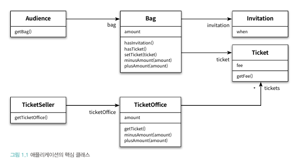

# 오브젝트 - 코드로 이해하는 객체지향 설계 PART 1 : 객체, 설계

### 티켓 판매 애플리케이션 구현

소극장을 운영하는 상황이다. 작은 이벤트로 추첨을 통해 관람객에게 공연을 무료 관람할 수 있는 초대장을 발송하기로 했다. 

이벤트가 종료되고 예정된 공연 날에 공연을 진행하려 한다. 이 때 공연을 보려는 사람들 중에는 이벤트에 당첨되어 초대장을 가진 사람과 아닌 사람들이 있다.

이 때 우린 두 부류의 사람들을 다른 방식으로 입장시켜야 한다. **티켓을 구매하거나, 초대장을 티켓으로 교환하거나** 둘 중 하나로 입장시켜야 한다.

> ***클래스***
> 



```java
// 위 클래스들과 협력하는 '소극장' 객체
public class Theater {
	private TicketSeller ticketSeller;

	public Theater(TicketSeller ticketSeller) {
		this.ticketSeller = ticketSeller;
	} 

	public void enter(Audience audience) {
		if (audience.getBag().hasInvitation()) {
			Ticket ticket = ticketSeller.getTicketOffice().getTicket();
			audience.getBag().setTicket(ticket);
		} else {
			Ticket ticket = ticketSeller.getTicketOffice().getTicket();
			audience.getBag().minusAmount(ticket.getFee());
			ticketSeller.getTicketOffice().plusAmount(ticket.getFee());
			audience.getBag().setTicket(ticket);
		}
	}
}
```

---

### 예상을 빗나가는 코드

지금 이 애플리케이션에 문제가 있을까. 로버트 마틴은 *모듈은 제대로 실행되어야 하며, 변경이 용이해야 하며, 이해하기 쉬워야 한다* 고 말한다. 

위 애플리케이션은 티켓을 가진 손님과 아닌 손님을 명확하게 구분하며, 티켓을 구매할 때 현금의 증감까지 완벽하게 구현하였다. 분명히 제대로 수행되고 있다. 하지만 문제는 분명히 존재한다. 바로 2,3번째 조건을 만족시키지 못한다. 그 이유는 바로 ***enter*** 메서드가 수행하는 일에 있다. 

> *소극장 객체는 관람객의 가방을 열어 그 안에 초대장이 들어 있는지 살펴본다. 가방 안에 초대장이 들어 있으면  판매원은 매표소에 보관돼 있는 티켓을 관람객의 가방 안으로 옮긴다. 가방 안에 초대장이 들어 있지 않다면 관람객의 가방에서 티켓 금액만큼의 현금을 꺼내 매표소에 적립한 후에 매표소에 보관돼 있는 티켓을 관람객의 가방 안으로 옮긴다.*
> 

여기서 문제는 **관람객과 판매원이 소극장의 통제를 받는 수동적인 존재**라는 점이다. 동작하는 대부분의 일들이 우리의 예상을 벗어난다. 소극장이 관람객의 가방을 연다는 개념이 이해되는가? 판매원이 티켓을 관람객의 가방으로 멋대로 옮기거나, 관람객의 가방에서 현금을 꺼내는게 이해되는가?

티켓을 관람객의 가방 안으로 옮기거나, 현금을 꺼내거나, 초대장이 들어있는지 확인하는 것 모두 관람객이 해야하는 일이지 판매원이 하는 일이 아니다. 코드의 동작방식은 우리의 상식과는 많이 다르다.

또한 하나의 클래스 혹은 메서드가 너무 많은 세부사항을 다룰 뿐더러 ***Audience***와 ***TicketSeller*** 를 변경할 경우 ***Theater***도 변경해야 한다는 가장 중요한 문제점이 있다.

---

### 변경에 취약한 코드

위에서 말했듯 **변경에 취약**하다. 만약 관람객이 가방을 들고 있지 않다고 가정해보자. 이럴때 우린 ***Audience*** 뿐만 아니라 ***Audience***의 ***Bag*** 에 접근하는 ***Theater.enter()*** 까지 수정해야한다.

***Theater***는 ***Audience*** 에 의존한다. 그리고 이것은 변경과 관련되어있다. 어떤 객체(Audience)가 변경될 때 그 객체에 의존하는 다른 객체(Theater)도 함께 변경될 수 있다는 것이다. 우리는 객체 사이의 의존성이 과한 경우를 **결합도(coupling)가 높다**고 말한다.

물론 의존성을 완전히 제거하는 것이 정답이 아니라 기능을 구현하는 데에 필요한 최소한의 의존성만 유지하는 것이 좋다. 즉, 우리의 최종 목표는 의존성을 낮춰 객체의 변경이 다른 객체에 많은 영향을 끼치지 않는 변경이 용이한 설계를 만드는 것이다. 

여기서 키워드는 변경과 의사소통이라는 문제가 서로 엮여 있다는 것이다. 우리는 관람객과 판매원이 자신의 일을 스스로 처리하길 기대하지만 코드는 그렇지 않기 때문에 이해하기 어려워진 것이다. 객체가 다른 객체에 메세지를 보내지 않고 **직접 접근하는 것은 객체가 서로 결합되어있다는 것을 의미**한다.

해결방법은 간단하다. 객체가 다른 객체의 세세한 부분까지 알지 못하도록 정보를 차단하면 된다. 즉, 관람객이 가방을 갖고 있다는 사실과 판매원이 매표소에서 티켓을 판매한다는 사실을 ***Theater*** 가 알아야할 필요가 없도록 만들면 된다. 다시 말해 관람객과 판매원을 자율적인 존재로 만들면 된다. 

---

### 자율성을 높이자

설계를 변경하기 어려웠던 이유는 ***Theater*** 가 ***Audience, TicketSeller , Bag, TicketOffice*** 를 모두 직접 접근할 수 있었기 때문이다. 우리는 ***Audience, TicketSeller*** 가 직접 ***Bag, TicketOffice*** 을 처리하는 자율적인 존재가 되도록 변경하면 된다.  

> ***TicketSeller**에 **sellTo** 메서드를 추가한 뒤 **enter**의 로직을 옮긴다*
> 

```java
public class Theater {
	private TicketSeller ticketSeller;

	public Theater(TicketSeller ticketSeller) {
		this.ticketSeller = ticketSeller;
	} 

	public void enter(Audience audience) {
		**ticketSeller.sellTo(audience);**
	}
}
```

```java
// TicketSeller.sellTo()
public void sellTo(Audience audience) {
	if (audience.getBag().hasInvitation()) {
		Ticket ticket = ticketSeller.getTicketOffice().getTicket();
		audience.getBag().setTicket(ticket);
	} else {
		Ticket ticket = ticketSeller.getTicketOffice().getTicket();
		audience.getBag().minusAmount(ticket.getFee());
		ticketSeller.getTicketOffice().plusAmount(ticket.getFee());
		audience.getBag().setTicket(ticket);
	}
}
```

**getTicketOffice()** 메서드가 제거됐다. ***TicketSeller*** 가 일하는 ***ticketOffice*** 필드는 private이고, 접근 가능한 퍼블릭 메서드가 없다. 따라서 ***TicketSeller***만 접근 가능하다.

위 변경을 통해 ***TicketSeller***는 ***ticketOffice***에서 티켓을 꺼내거나 판매 요금을 적립하는 일들을 스스로 수행하도록(할 수 밖에 없다) 변경되었다. 이처럼 개념,물리적으로 객체 내부의 세부사항을 감추는 것을 **캡슐화**라고 한다.

이제 수정된 ***Theater*** 클래스 어디서도 ***ticketOffice***에 접근하지 않는다. 오직 ***TicketSeller***의 인터페이스(***sellTo***)에만 의존하며, ***TicketSeller***가 ***ticketOffice*** 인스턴스를 포함하고 있다는 사실은 구현의 영역에 속하게 되고 자연스럽게 ***Theater***의 ***enter*** 메소드를 통해 갖고 있던 ***TicketOffice***에 대한 의존성이 제거되었다.

> ***TicketSeller**가 **Audience**의 **Bag**에 직접 접근하는 것을 제거한다*
> 

```java
public class TicketSeller {
	private TicketOffice ticketOffice;
	
	public TicketSeller(TicketOffice ticketOffice) {
		this.ticketOffice = ticketOffice;
	}

	public void sellTo(Audience audience) {
		**ticketOffice.plusAmount(audience.buy(ticketOffice.getTicket()));**
	}
}
```

변경 전엔 초대장이 없으면 티켓을 ***ticketOffice***에게 전달받아 가방에 넣고, 초대장이 있으면 티켓을 구매하여 ***ticketOffice***에게 전달받아 가방에서 현금을 마이너스하고, 가방에 넣는 행동을 ***sellTo*** 안에서 ***TickSeller***가 직접 수행했다. 

즉 ***TickSeller***가 ***Audience***의 ***Bag***에 직접 접근하게 되어 ***Audience***는 여전히 자율적인 존재가 아니었다. 따라서 우리는 ***Audience*** 가 직접 ***buy*** 메서드를 통해 자신의 가방안에 초대장이 들어있는지를 스스로 확인하고 티켓을 구매하도록 변경하였다. 

이를 통해 ***TickSeller***는 ***Audience***가 ***Bag***을 가지고 있는지 알 필요가 없어지게 됐고, 결과적으로 우리는  ***Bag***의 존재를 내부로 캡슐화할 수 있게 됐다.

---

### 무엇이 개선됐는가

위 과정을 통해 우리는 모든 객체가 자율적인 존재가 되도록 변경해보았다. 그렇다면 로버트 마틴의 세 가지 조건을 만족하는지 다시 한번 확인해보자.

첫번째, **기능을 오류없이 수행**한다. 두번째, 수정된 ***Audience***와 ***TickSeller***는 자신의 소지품을 스스로 관리한다. 이것은 우리의 예상과 일치하기 때문에 의사소통이라는 관점으로 바라보았을 때 이전의 **코드가 갖던 비상식적인 행동 역시 개선**되었다. 또한 각 내부 구현을 변경하더라도 우리는 ***Theater*** 를 변경할 필요가 없다. 따라서 세번째, **변경 용이성** 역시 확실히 개선되었다.

---

### 어떻게 한 것인가

본인의 문제는 본인이 해결하도록 변경했다. 판매자가 티켓을 판매하기 위한 행동은 판매자(***TickSeller***)에게 옮겼고, 구매자가 티켓을 구매하기 위한 행동은 구매자(***Audience***)에게 옮겼다. 

---

### 캡슐화와 응집도

이번 작업은 ***Theater***가 ***Audience***의 내부에 대해선 전혀 알지 못한 채(*캡슐화* ) ***buy*** 라는 메시지에 응답할 수 있다고 인식한채 요청(*위임* )하도록 수정했다. 즉 본인과 연관된 작업만 수행하고 연관성이 없는 작업은 다른 객체에게 위임하도록 변경된 것이다. 우리는 이를 **응집도가 높다**고 말한다.

객체의 응집도를 높이기 위해서는 객체 스스로 자신의 데이터를 책임져야 한다. 이것이 외부의 간섭을 배제하고 메시지를 통해서만 협력하는 설계, 훌륭한 객체지향 설계를 이루기 위한 지름길이다. 

---

### 절차지향과 객체지향

우리는 변경 전 ***Theater***의 ***enter*** 메서드에서 ***Audience, Bag, TicketOffice***를 가져와 관람객을 입장시키는 절차를 구현했다. 이 때 ***Audience, TickSeller, Bag, TicketOffice*** 는 절차를 구현하는데 필요한 정보를 제공했고, 입장시키는 처리 순서는 메서드 내부에 존재했다.

이 관점에서 ***enter*** 메서드는 *프로세스(Process)* 이며, ***Audience, TickSeller, Bag, TicketOffice***는 *데이터(Data)* 다. 이처럼 프로세스와 데이터를 별도의 모듈에 위치시키는 방식을 우리는 *절차적 프로그래밍이(Procedural Programming)*라고 한다. 

이 방식으로 코드가 작성될 경우 객체가 다른 객체에 강한 의존성을 띄게 된다. 이는 작은 변경이 수많은 객체에게까지 영향을 주는 변경하기 어려운 코드를 양산하는 기반이 된다. 

변경하기 쉬운 설계는 한 번에 하나의 클래스만 변경할 수 있는 설계다. 절차적 프로그래밍은 프로세스가 필요한 모든 데이터에 의존해야 한다는 근본적인 문제점 때문에 변경에 취약하다.

따라서 우리는 객체가 자신의 데이터를 스스로 처리하도록 프로세스의 단계를 객체에게 분할하였고, **데이터와 프로세스가 동일한 모듈 내부에 위치**하도록 변경했다. 이를 우리는*객체지향 프로그래밍(Object-Oriented Programming)*이라고 부른다.

물론 변경 후에도 ***Theater***는 ***TickSeller***에게***, TickSeller***는 ***Audience***에게 의존한다. 하지만 이것은 적절히 통제되었으며 변경으로 인한 여파가 여러 클래스로 전파되는 것을 효율적으로 억제한다. 휼륭한 객체지향 설계는 의존성을 없애는 것이 아니다. 적절히 관리하여 객체 사이의 결합도를 낮추는 것이 핵심이다. 

---

### 책임의 이동

‘책임’은 기능을 가리킨다. 위 두 방식의 차이점은 작업 흐름이 누구로부터 제어되는지를 보면 알 수 있다.

기존 코드(절차지향)의 경우 ***Theater***에 의해 제어된다. 즉 책임이 ***Theater*** 에 집중되어 있다는 것이다.

하지만 변경된 코드(객체지향)는 제어 흐름이 각 객체에 적절하게 분산되어 있다. 하나의 기능을 완성하는데 필요한 책임이 여러 객체에 알맞게 분산되어 있다는 것이다.

객체지향은 단순히 데이터와 프로세스를 하나의 객체 안으로 모으는 것 이상으로, **적절한 객체에 적절한 책임을 할당**하는 것이다.

설계를 어렵게 만드는 것은 의존성이다. 불필요한 의존성을 제거하면 결합도가 낮아지고, 이를 위해 우리는 캡슐화라는 방법을 사용했었다. 불필요한 세부사항을 객체 내부로 캡슐화하는 것은 객체의 자율성을 높이고 응집도 높은 객체들의 공동체를 창조할 수 있는 방법이다.

---

### 더 개선할 수 있다

우리는 추가적인 수정을 통해 ***Bag, TicketOffice*** 의 자율권을 찾아줬다. 결국 우리는 인터페이스에만 의존할 수 있도록 변경했다. 

하지만 이는 결과적으로 ***TicketOffice*** 와 ***Audience*** 사이에 의존성을 추가하는 또 다른 단점을 낳았다.

여기서 우리는 결국 ***TicketOffice*** 의 자율성과 ***Audience***의 결합도 중 둘 중 하나를 포기해야하는 트레이드 오프 상황에 닥치게 된다.

우리는 결국 훌륭한 설계라는 것은 적절한 트레이드 오프의 결과물이라는 것을 인식해야 한다. 

---

### 그래, 거짓말이다!

보통 코드는 우리 평소의 직관에 따를 때에 이해하기 쉬운 경향이 있다. 하지만 ***Theater, Bag, TicketOffice*** 를 생각해보면 우리의 직관과는 일치하지 않는다. 이들은 실세계에서 자율적인 존재가 아니기 때문이다. 하지만 객체지향의 세계에서는 모두가 능동적이고 자율적인 존재다.
