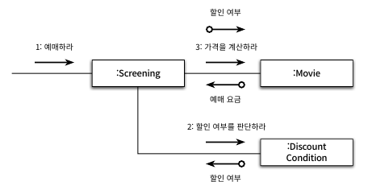
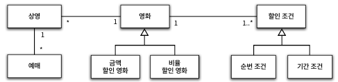

# 오브젝트 PART 5 - 책임 할당하기

책임에 초점을 맞춰 설계할 때 우리가 직면하는 어려움은 **어떤 객체에게 어떤 책임을 할당할 지를** 결정하기가 쉽지 않다는 것이다. 이는 일종의 트레이드 오프인데, 동일한 문제에 다양한 책임 할당 방법이 존재하며 이는 상황과 문맥에 따라 달라진다. 

따라서 우리는 그 방법 중 하나인 GRASP 패턴에 대해 알아볼 것이다. 이를 통해 응집도와 결합도, 캡슐화와 같은 다양한 기준에 따라 책임을 할당하고 결과를 트레이드오프할 수 있는 기준을 얻을 수 있을 것이다.

---

### 데이터보다 행동을 먼저 결정하라

> *데이터보다 행동을 먼저 결정하라*
> 

우리는 이전 장에서 데이터에 초점이 가있을 때에 발생하는 문제점들을 살펴봤다. 그렇다면 우린 초점을 어떻게 책임으로 옮길 수 있을까. 바로 객체를 바라볼 때 첫 질문을 통해 이룰 수 있다. 

- **데이터 중심 설계**

우리는 이전 장에서 데이터 중심 설계의 문제점들을 살펴봤다. 객체에게 중요한 것은 데이터가 아니라 책임이었고, 이 책임은 다른 객체의 요청 즉 오부에 제공하는 행동이다. 데이터는 단지 책임을 수행하기 위한 재료일 뿐이다. 그렇다면 우린 초점을 어떻게 책임으로 옮길 수 있을까. 객체를 설계할 때 시작하는 첫번째 질문을 통해 이룰 수 있다. 

- **데이터 중심 설계**

*“객체가 포함해야 하는 데이터가 무엇인가? → 데이터를 처리하는데 필요한 오퍼레이션은 무엇인가”*

- **책임 중심 설계**

*“이 객체가 수행해야 하는 책임은 무엇인가? → 이 책임을 수행하는데 필요한 데이터는 무엇인가?*

---

### 협력이라는 문맥 안에서 책임을 결정하라

책임의 품질은 객체의 입장이 아닌 객체가 참여하는 협력에 얼마나 적합한가에 달려있다. 메시지는 클라이언트의 의도를 표현하며, 수신할 객체보다 메시지를 먼저 결정해야한다고 얘기했던 것을 기억하라. 그리고 메시지를 수신하기로 결정된 객체는 메시지를 처리할 책임을 할당받는다. 

이는 결국 책임의 품질은 수행하는 동작이 '얼마나 클라이언트의 요구에 부합하는지'와 동일하다는 것을 의미한다. 메시지가 결정되고 수신자가 결정된다. 따라서 수신자에 대한 어떠한 가정 및 예측도 메시지에 반영되지 않는다. 자연스러운 캡슐화가 탄생하는 과정이다. 

---

### 책임 할당을 위한 GRASP 패턴

General Responsibility Assignment Software Pattern(일반적인 책임 할당을 위한 소프트웨어 패턴)

우선 바로 설계를 시작하는 것은 어렵다. 도메인의 개략적인 모습을 그려보고 찾을 수 있는 도메인 개념들을 책임 할당의 대상으로 사용하면 코드에 도메인을 투영하기 수월해진다.

---

### 정보 전문가에게 책임을 할당하라

기능은 애플리케이션의 책임이다. 또한 이 책임은 애플리케이션에 대해 전송된 메시지다. 이 메시지를 책임질 첫 번째 객체를 선택하는 것으로 설계를 시작해야한다.

영화 예매 시스템을 예시로 객체와 책임을 설계하는 튜토리얼을 시작해보자. 우선 우리는 송신자가 확실하지는 않지만 *예매하라*라는 메시지(책임)을 수신했다. 그리고 우린 이 메시지를 처리할 객체가 누구일지 한번 생각해봐야 한다. 

이 때 우리는 객체가 스스로의 상태를 처리하는 자율적인 존재라는 사실을 다시 한번 상기시킬 필요가 있다. 객체의 책임(메시지)과 이를 수행하는 데 필요한 상태(정보)는 반드시 동일한(메시지를 수신한) 객체 안에 존재해야한다. 따라서 첫번째 원칙은 우린 책임을 수행할 정보를 알고 있는 객체에게 책임을 할당하는 것이다. 이를 우린 **INFORATION EXPERT(정보 전문가) 패턴**이라고 한다. 객체는 데이터를 반드시 저장해야할 필요는 없다는 것을 이해하자. 해당 정보를 제공할 수 있는 다른 객체를 알고 있거나 저장하지 않고 계산을 통해 제공해도 정보라고 표현할 수 있다. 

그렇다면 위에서 언급한 영화 예매 시스템을 예시로 순서대로 책임의 할당 프로세스를 보자.

1. *예매하라*
    
    과연 예매하는데 필요한 정보를 누가 가장 많이 알고 있을까. 아마 도메인 개념에서 유추했을 때에는 '상영' 객체이지 않을까? 상영은 영화 정보와 상영 시간, 순번 등 영화를 예매하기 위해 필요한 정보들을 알고 있다. 상영은 영화를 예매하는데에 고수다. 이는 코드에서 Screening 객체로 표현되어있고 웅리는 영화를 예매하는 책임을 Screening 객체에게 할당했다. 따라서 Screening 객체는 _'예매하라'_ 라는 메시지를 수신할 수 있다. 
    
    자, 그렇다면 Screening 객체가 이 메시지를 처리하기 위해서 수행해야하는 작업은 무엇일지 확인해보자. 우선 영화를 예매하려면 가격을 지불해야한다. 따라서 다음 메시지는 *가격을 계산하라* 가 될 것이다. 하지만 상영에선 예매 가격을 알 수 없다. 예매 가격이라는 이 정보는 누가 가장 잘 알고 있을까. 이 메시지를 책임질 객체는 누구일까. 
    
2. *가격을 계산하라* 
    
    가격을 계산하기 위해 필요한 정보를 누가 알고 있는가? 바로 Movie다. 따라서 *가격을 계산하라*라는 메시지를 수신하는 객체는 Movie가 된다. 하지만 우리는 할인 정책이 있다. 할인 정책은 스스로 처리할 수 없어 할인 조건에 해당되는지 판단해야 한다. 따라서 우리는 *할인 여부를 판단하라* 메시지를 전송해 외부의 도움을 요청해야한다.
    
    이 메시지는 누가 처리할 수 있을까. 위 책임에 대한 정보 전문가는 누구일까. 바로 할인 조건 DiscountCondition이다. 책임을 할당하자.
    
3. *할인 여부를 판단하라*
    
    DiscountCondition은 자체적으로 할인 여부를 판단하는데 필요한 모든 정보를 알고있다. 따라서 외부의 도움은 필요없다. 그렇다면 메시지를 처리하고 할인 가능 여부를 반환하면 된다. 
    

이후는 역순에 따라 메시지의 응답들을 받아 *예매하라* 메시지의 책임을 시스템이 완수하게 된다. 이처럼 메시지(책임)를 처리하기 위해 정보 전문가 객체들을 선택하며, 처리 불가능한 부분은 다른 정보 전문가에게 위임하는 메시지를 다시 전송하는 협력 관계를 통해 우리는 자율성이 높은 객체들로 구성된 협력 공동체를 구축할 수 있게 되었다.
---

### 높은 응집도와 낮은 결합도

앞선 예제에서 우린 Movie 객체가 *할인 여부를 판단하라* 라는 메시지를 DiscountCondition 에게 전송했다. 혹시 Movie 대신 Screening이 직접 DiscountCondition과 협력하는 것은 어떨까. 이를 위해서는 Screening이 DiscountCondition에게 *할인 여부를 판단하라* 라는 메시지를 전송하고 반환받은 할인 여부를 Movie에 전송하는 메시지의 인자로 전달하도록 수정해야한다.  



설계는 기능적인 측면에서는 이전과 동일하다. 차이점은 응집도와 결합도에 있다. 우리는 항상 높은 응집도와 낮은 결합도를 지향해야 한다고 했다. 즉, 기능상 동일하다면 **높은 응집도(HIGH COHESION) 패턴**과 **낮은 결합도(LOW COUPLING) 패턴**을 가지는 설계를 선택해야 한다는 것이다.



그렇다면 바꾼 설계는 각각 패턴의 관점에서는 어떻게 평가될까. 우리는 도메인 개념을 재점검하여 이 해답을 찾을 수 있다. 먼저 낮은 결합도의 관점에서 확인해보자. 영화 Movie는 이미 할인 조건 DiscountCondition과 연결되어 있다. 하지만 상영 Screening 은 그렇지 않다. 따라서 만약 상영과 할인 조건이 협력하기 위해선 결합도를 추가해야 한다. 따라서 영화와 협력하는 관계를 유지하는 편이 낫다.

높은 결합도의 관점에서 확인해보자. 상영 Screening 의 가장 중요한 책임은 **예매를 생성하는 것**이다. 하지만 할인 조건 DiscountCondition 과 협력하게 된다면 상영은 영화 요금 계산의 책임 일부를 떠안게 된다. 즉 상영은 할인 여부를 판단할 수 있지만 대신 영화가 할인 여부를 필요로 한다는 사실까지 알아야 한다. 다시 말해 상영에 할인 조건에 대한 의존성이 생긴다는 것이다.

반면 영화의 주된 책임은 영화 요금을 계산하는 것이다. 당연히 계산하기 위해선 할인 조건과 협력해야 되기 때문에 응집도에 아무런 해도 끼치지 않는다. 따라서 역시 영화와 협력하는 관계가 낫다.

---

### 창조자에게 객체 생성 책임을 할당하라

우리는 지금까지 객체에게 쪼개진 책임들을 할당했다. 그리고 그 책임들은 *예매하라* 에서 시작된 것이었다. 즉 Reservation 객체를 생성하는 것이 첫번째 책임을 수행한 결과다. 이는 협력에 참여하는 어떤 객체에게는 책임을 수행하는 것이 Reservation 인스턴스를 생성하는 작업이라는 것을 의미한다.

**GRASP의 CREATOR(창조자) 패턴**은 이 경우에 사용할 수 있는 책임 할당 패턴으로 객체를 생성할 책임을 어떤 객체에게 할당할지에 대한 지침이다. 이 때 우리는 만들고자 하는 인스턴스를 잘 알고, 긴밀하게 사용하며 초기화에 필요한 데이터를 가지는 객체에게 창조자 역할을 부여해야한다. 

따라서 우리에겐 예매를 생성하는 영화, 상영시간, 순번 등을 알고 있으며, 예매 요금을 계산하는데 필요한 Movie 객체까지 알고 있는 Screening 가 적임자였다. 이를 검증해보자.

---

### 구현을 통한 검증

1. Screening 은 예매를 성공적으로 수행하고 Reservation 객체를 생성해야한다.
    1. 책임을 수행하는데 필요한 상영시간(*whenScreened*), 상영순번(*sequence*)를 인스턴스 변수로 포함시키자.
    2. Movie에게는 가격을 계산하라 메시지를 전송해야함으로 영화 Movie에 대한 참조도 포함시키자.
    
    이 때 우리는 Movie 에게 Screening 본인을 넘겨준다. 상영정보를 알아야 예매를 할 수 있으니까. 또한 Movie에게 예매 가격을 얻을 수 있는 방법은 딱 하나, 메시지다. 따라서 메시지가 변경되지 않는 한 내부 구현이 아무리 바뀌어도 영향을 받지 않는다. 이렇게나 쉽게 캡슐화와 낮은 결합도를 가질 수 있다.
    
2. Movie 객체는 요금을 계산해야 한다.
    1. 요금을 계산하기 위해 기본 금액(fee), 영화 타입(movieType), 할인 조건(discountConditions), 할인 정책 등의 정보를 알아야 하니 인스턴스 변수로 포함시키자.
    2. 앞서 전달받은 상영 정보가 할인받을 수 있는 지에 대한 판단은 DiscountCondition에 위임한다. 이를 할인 조건에게 위임함으로써 앞선 1번처럼 메시지만 알면 할인 여부를 알 수 있다. 
    3. 할인 조건에 만족한다면 얼마를 할인할 것인지는 movieType이 어떤 형태인지를 확인하여 할인액을 결정한다. 
3. DiscountCondition은 할인 여부를 판단해야 한다.
    1. Movie 에게 전달받은 메시지를 처리하기 위해 기간 조건을 위한 요일(dayOfWeek), 시작시간(startTime), 종료시간(endTime), 순번 조건을 위한 상영 순번(sequence)을 인스턴스 변수로 포함시키자.
    2. Movie가 할인 여부를 판단하기 위해 호출했던 isSatisfiedBy(Screening) 메서드와 위 메서드 내부에서 각 조건에 맞춰 호출되는 sSatisfiedByPeriod,  isSatisfiedBySequence 를 구현하자.

구현은 끝났다. 하지만 여기에도 몇가지 문제점이 있다.

---

### DiscountCondition 개선

위에서 구현한 DiscountCondition은 변경에 취약하다. 이것은 코드를 수정해야하는 이유가 하나 이상이라는 의미이며 여기엔 총 3가지의 문제점이 있다.

1.  *할인 조건의 추가*

	isSatisfiedBy(Screening) 메서드는 내부에서 각 조건에 맞춰 메서드를 호출한다고 했었다. 할인 조건에 추가된다면? 새로운 조건에 맞는 메서드를 호출하는 코드를 추가해줘야 한다.
    
2. *순번 조건을 판단하는 로직 변경*

    isSatisfiedBySequence 메서드의 내부 구현을 변경해야 한다. 
    
3. *기간 조건을 판단하는 로직 변경*
    
    isSatisfiedByPeriod 메서드의 내부 구현을 수정해야 한다.
    

이미 3개의 변경 이유를 갖기 때문에 응집도는 낮다. 응집도가 낮다는 것은 서로 연관성이 없는 기능이나 데이터가 하나의 클래스 안에 뭉쳐져 있다는 것을 의미한다. 따라서 우리는 이 문제를 해결하기 위해 변경의 이유에 따라 **클래스를 분리해야 한다.**

일반적으로 설계를 개선하는 작업은 변경의 이유가 하나 이상인 클래스를 찾는 것으로부터 시작하는 것이 좋다. 그리고 이런 변경을 필요로 하는 클래스들에는 몇 가지 패턴이 존재한다. 

1. *인스턴스 변수가 초기화되는 시점을 살펴보자. 응집도가 높다면 인스턴스를 생성할 떄 모든 속성들이 함께 초기화될 것이다.* *함께 초기화되는 속성을 기준으로 코드를 분리해야한다.*
2. *메서드들이 인스턴스 변수를 얼마나 사용하는지를 살펴보자. 응집도가 높다면 모든 메서드들이 객체의 모든 속성들을 남김없이 사용할 것이다.*

---

### 다형성을 통해 분리하기

그렇다면 어떻게 분리해야할까? DiscountCondition 은 순번 조건과 기간 조건을 둘다 포함하고 있었으니 이를 두 개의 클래스로 분리했다. 하지만 이렇게 변경되자 Movie와 유지하고있던 결합도가 두개로 늘어나 설계에 오히려 전체적인 결합도가 높아지는 악수가 되어버렸다. 그렇다면 이를 어떻게 해결해야할까. 슬슬 이 문제를 해결해줄 슈퍼맨 **역할**이 슬그머니 등장한다. 

사실 Movie 객체에게 SequenceCondition과 PeriodContion은 별 차이가 없다. 그저 할인 여부를 판단하기 위한 할인조건일 뿐이다. 두 조건은 상호 대체가 가능하고 이는 동일한 책임을 수행한다는 것을 으미한다. 즉 위 클래스들은 ‘할인 조건’ 이라는 역할을 수행하고 있는 것이며 구현을 공유할 필요가 없다. 따라서 DiscountCondition 을 인터페이스로 생성한 뒤 SequenceCondition 과 PeriodCondition이 인터페이스를 실체화하도록 수정하자.

```java
public interface DiscountCondition {
	boolean isSatisfiedBy(Screening screening);
}
```

```java
public class PeriodCondition implements DiscountContion {...}
public class SequenceCondition implements DiscountContion {...}
```

위 작업을 통해서 Movie는 협력하는 할인조건 객체의 타입을 몰라도 전혀 상관이 없다. 단지 DiscountCondition 역할만 수행할 수 있다면 충분하다. 이렇게 객체의 타입에 따라 변하는 행동이 있다면 타입을 분리하고 변화하는 행동을 각 타입의 책임으로 할당하면 된다. GRASP 에서는 이를 **POLYMORPHISM(다형성) 패턴**이라고 한다.

---

### 변경으로부터 보호하기

위 과정을 통해 두 개의 할인 조건을 DiscountCondition 역할을 갖는 각기 다른 클래스로 분리했다. 우리는 역할을 통해 Movie 로부터 구현 클래스들을 감춘 것이다.그렇다면  만약 새로운 할인 조건을 추가한다면 어떨까. Movie가 혹시 할인 조건이 몇개나 있는지 알고 있는가? 전혀 아니다. 그저 오매불망 떠나간 내 님을 기다리는 망부석처럼 DiscountCondition 타입만 바라볼 뿐이다. 

즉 DiscountCondition 인터페이스를 실체화하는 클래스를 추가하는 것만으로 우리는 종류를 무한히 확장할 수 있다. 이처럼 변경을 캡슐화하도록 책임을 할당하는 것을 GRASP에서는 **PROTECTED VARIATIONS(변경 보호) 패턴**이라고 부른다.

---

### Movie 클래스 개선하기

그런데 어디서 낑낑거리는 소리가 들린다. 우리가 지금 해결한 문제는 Movie 객체 역시 겪고있었다. 그 이유는 비율 할인 정책 영화와 금액 할인 정책 영화라는 두가지 타입을 하나의 클래스 안에서 구현하고 있기 때문이었다. 이 문제 역시 DiscountCondition과 동일하게 해결할 수 있다. 역할의 개념을 도입하면 끝이다. POLYMORPHISM 패턴을 통해 Screening과 Movie가 구체 클래스가 아닌 역할과 다형적으로 협력하도록 변경하면 된다. 

```java
public abstract class Movie {
    private String title;
    private Duration runningTime;
    private Money fee;
    private List<DiscountCondition> discountConditions;

    public Movie(String title, Duration runningTime, Money fee, DiscountCondition... discountConditions) {
        this.title = title;
        this.runningTime = runningTime;
        this.fee = fee;
        this.discountConditions = Arrays.asList(discountConditions);
    }

    public Money calculateMovieFee(Screening screening) {
        if (isDiscountable(screening)) {
            return fee.minus(calculateDiscountAmount());
        }

        return fee;
    }

    private boolean isDiscountable(Screening screening) {
        return discountConditions.stream()
                .anyMatch(condition -> condition.isSatisfiedBy(screening));
    }

    protected Money getFee() {
        return fee;
    }

    abstract protected Money calculateDiscountAmount();
}
```

이전 코드에 있었던 discountAmout, discountPercent 인스턴스 변수들은 사라지고 할인금액을 계산하는 calculateDiscountAmount 메서드를 추상 메서드로 선언해 해당 역할을 수행하는 서브클래스들이 할인 계산 방식을 원하는대로 오버라이딩할 수 있도록 변경했다. 아래는 서브클래스들이다.

```java
public class AmountDiscountMovie extends Movie {
    private Money discountAmount;

    public AmountDiscountMovie(String title, Duration runningTime, Money fee, Money discountAmount,
                               DiscountCondition... discountConditions) {
        super(title, runningTime, fee, discountConditions);
        this.discountAmount = discountAmount;
    }

    @Override
    protected Money calculateDiscountAmount() {
        return discountAmount;
    }
}
```
```java
public class PercentDiscountMovie extends Movie {
    private double percent;

    public PercentDiscountMovie(String title, Duration runningTime, Money fee, double percent,
                                DiscountCondition... discountConditions) {
        super(title, runningTime, fee, discountConditions);
        this.percent = percent;
    }

    @Override
    protected Money calculateDiscountAmount() {
        return getFee().times(percent);
    }
}
```

위처럼 수행하면 우리는 할인 조건이 적용된 상태로 금액을 계산해야하는 Movie 객체를 구현할 수 있다. 마지막으로 데이터 중심 설계와 책임 중심 설계의 차이점을 한번 더 짚고 넘어아겠다. 우리는 데이터 중심으로 설계된 설계를 책임 중심으로 변경하며 내부 구현을 캡슐화했고 모든 클래스들으 변경 이유가 오직 하나만 되도록 수정했다. 이를 통해 클래스들은 높은 응집도와 느슨한 결합도를 갖게 되었으며, 클래스는 오롯이 본인의 책임 하나만 수행하면 되도록 변경됐다. 책임 중심의 설계는 이렇게나 많은 장점을 갖는다.

---

### 변경과 유연성

우리가 책임 중심 설계이든 데이터 중심 설계이든 이루고자 하는 궁극적인 목적은 결국 변경에 잘 대비하기 위해서이다. 예를 들어 영화에 설정된 할인 정책을 런타임 안에서 변경할 수 있어야 한다는 요구사항이 추가됐다고 가정해보자. 지금의 설계는 상속을 통해 할인 정책을 구현했기 때문에 런타임에서는 새로운 인스턴스를 생성해 정보를 복사하는 방법 외에는 해결책이 없다. 하지만 이는 너무나도 복잡하며 혼란스러움을 야기한다. 따라서 우리는 상속 대신 **합성**이라는 것을 사용해 위 요구사항을 해결할 수 있다.

앞서 상속을 통해 구현했던 할인 정책 서브 클래스 대신 DiscountPolicy라는 인스턴스 변수로 분리한 뒤 Movie에 합성시키면 끝난다.

```java
public class Movie {
	...
    private DiscountPolicy discountPolicy;
    ...
    
    public void changeDiscountPolicy(DiscountPolicy changedDiscountPolicy){
    	this.discountPolicy = changedDiscountPolicy;
    }
}
```
이를 통해 새로운 할인 정책이 추가되더라도 할인 정책을 변경하는데 필요한 추가 코드를 작성할 필요가 없어졌다. 그저 새로운 할인 정책 클래스를 추가하고 그 인스턴스를 changeDiscountPolicy 메서드에 전달하면 끝이다. 이처럼 유연한 설계는 의존성을 어떻게 관리하는지에 달려있다. 우리는 구체적인 세부사항이 아닌 역할에 의존하며 강한 결합도를 끊어내는 연습을 해본 것이다.

---

### 리팩터링, 메서드 응집도

앞선 [Reservation의 reserve 메서드](https://github.com/eternity-oop/object/blob/master/chapter04/src/main/java/org/eternity/movie/step01/ReservationAgency.java)를 기억하는가. 너무 길어 작성하기도 힘들어 링크를 참조했다. 보고 왔다면 아마 충격을 금치 못할 것이다. 이렇게 데이터 중심 설계로 작성된 메서드들은 아래와 같은 문제가 있다.

- 어떤 일을 수행하는지 한눈에 파악하기 어렵다기 때문에 코드를 전체적으로 이해하는데 너무 많은 시간이 걸린다.
- 하나의 메서드 안에서 너무 많은 작업을 처리하기 때문에 변경이 필요할 때 수정해야 할 부분을 찾기 어렵다.
- 메서드 내부의 일부 로직만 수정하더라도 메서드의 나머지 부분에서 버그가 발생할 확률이 높다.
- 로직의 일부만 재사용하는 것이 불가능하다.
- 코드를 재사용하는 유일한 방법은  원하는 코드를 복사해서 붙여넣는 것뿐이므로 코드 중복을 초래하기 쉽다.

위처럼 아주 길고 응집도도 낮으며 이해하기도 재사용하기도 변경하기도 어려운 메서드를 **몬스터 메서드(monster method)** 라고 한다. 우리는 이 녀석을 변경해야 한다. 그리고 그 목적은 응집도 있는 수준으로 분해하여 책임을 분배하는 것이다.아래 변경된 코드를 확인해보자.

```java
public class ReservationAgency {
    public Reservation reserve(Screening screening, Customer customer,  int audienceCount) {
        boolean discountable = checkDiscountable(screening);
        Money fee = calculateFee(screening, discountable, audienceCount);
        return createReservation(screening, customer, audienceCount, fee);
    }

    private boolean checkDiscountable(Screening screening) {
        return screening.getMovie().getDiscountConditions().stream()
                .anyMatch(condition -> isDiscountable(screening));
    }
    
    public boolean isDiscountable(DiscountCondition condition, Screening screening) {
        if (condition.getType() == DiscountConditionType.PERIOD) {
            return isSatisfiedByPeriod(condition, screening);
        }

        return isSatisfiedBySequence(condition, screening);
    }
    
    private boolean isSatisfiedByPeriod(DiscountCondition condition, Screening screening) {
        return screening.getWhenScreened().getDayOfWeek().equals(condition.getDayOfWeek) &&
                startTime.compareTo(screening.getWhenScreened().toLocalTime()) <= 0 &&
                endTime.compareTo(screening.getWhenScreened().toLocalTime()) >= 0;
    }

    private boolean isSatisfiedBySequence(DiscountCondition condition, Screening screening) {
        return condition.getSequence() == screening.getSequence();
    }
    
    private Money calculateFee(Screening screening, boolean discountable, int audienceCount) {
        if (discountable) {
            return screening.getMovie().getFee()
                    .minus(calculateDiscountedFee(screening.getMovie()))
                    .times(audienceCount);
        }

        return  screening.getMovie().getFee().times(audienceCount);
    }

    private Money calculateDiscountedFee(Movie movie) {
        switch(movie.getMovieType()) {
            case AMOUNT_DISCOUNT:
                return calculateAmountDiscountedFee(movie);
            case PERCENT_DISCOUNT:
                return calculatePercentDiscountedFee(movie);
            case NONE_DISCOUNT:
                return calculateNoneDiscountedFee(movie);
        }

        throw new IllegalArgumentException();
    }

    private Money calculateAmountDiscountedFee(Movie movie) {
        return movie.getDiscountAmount();
    }

    private Money calculatePercentDiscountedFee(Movie movie) {
        return movie.getFee().times(movie.getDiscountPercent());
    }

    private Money calculateNoneDiscountedFee(Movie movie) {
        return movie.getFee();
    }

    private Reservation createReservation(Screening screening,
                                          Customer customer, int audienceCount, Money fee) {
        return new Reservation(customer, screening, fee, audienceCount);
    }
}
```

비록 이 과정을 통해 클래스의 길이가 길어질수도 있지만 명확성의 가치는 훨씬 올라간다. 아래는 변경 후 예매를 생성하는 부분만 발췌한 것이다. 이렇게 완성된 코드는 상위 수준의 명세를 읽는 것 같은 느낌을 준다. 각각의 책임들이 메서드 이름으로 나타나 각 객체들이 어떤 것을 수행하는지를 술술 풀어내기 때문이다. 

```java
public Reservation reserve(Screening screening, Customer customer, int audienceCount){
	boolean discountable = checkDiscountable(screening);
	Money fee = calculateFee(screening, discountable, audienceCount);
	return createReservation(screening, customer, audience, fee);
}
```

코드를 작은 메서드로 분해하면 전체적인 흐름을 이해하기도 쉽다. 만약 어떻게 내부에서 어떤 일들이 일어나는지를 확인하고 싶다면 그때 구현을 확인하면 된다.

하지만 여기서도 문제가 있다. 메서드들의 응집도는 높아졌지만 이 메서드를 담고 있는 클래스의 응집도가 여전히 낮다. 따라서 이를 개선하기 위해 변경의 이유가 다른 메서드들은 **각 메서드가 사용하는 데이터를 정의하고 있는 클래스로 분배**해야 한다.

---

### 객체를 자율적으로 만들자

위 단계에서 우리는 몬스터 메서드의 해체 작업을 진행했다. 그런데 한가지 의문점이 생길수도 있다. 과연 이 메서드들을 옮긴다면 어떤 클래스로 이동시켜야할까. 정답은 객체는 항상 자율적이어야 한다는 문장에 있다. 자신이 소유하고 있는 데이터를 자기 스스로 처리하는 객체가 자율적이다. 따라서 메서드가 사용하는 데이터를 저장하고 있는 클래스로 메서드를 이동시키면 된다. 

```java
public class DiscotunCondition {
	...
    public boolean isDiscountable(Screening screening) {
        if (type == DiscountConditionType.PERIOD) {
            return isSatisfiedByPeriod(screening);
        }

        return isSatisfiedBySequence(screening);
    }
}
```

isDiscountable은 DiscountCondition의 getType 메서드를 통해 할인 조건의 타입을 알아낸 뒤 isSatisfiedBy~ 메서드를 호출한다. 그리고 호출된 메서드도 할인 여부를 판단하기 위해 DiscountCondition의 getter를 사용한다. 즉 사용하는 데이터들은 대부분 DiscountCondition에 저장되어있. 따라서 우리는 이 메서드를 DiscountCondition으로 옮긴 뒤 ReservationAgency에서 삭제하면 된다.

---
