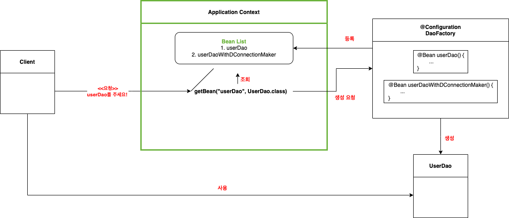

# 1장: 오브젝트와 의존관계

### 1. 초난감 DAO

- JDBC를 이용하는 작업의 일반적인 순서
    - DB 연결을 위한 Conneciton을 가져옴
    - SQL을 담은 Statement or PreparedStatement를 만든다.
    - 만들어진 Statement를 실행한다.
    - 조회라면 쿼리 실행 결과를 ResultSet으로 받아 오브젝트에 옮긴다
    - 작업 중에 생성된 Connection, Statement, Resulst 리소스는 작업 후 반드시 닫아야 한다.
    - JDBC API가 만드는 에외는 직접 처리하거나 throws를 통해 밖으로 던지게 한다.
- 스프링을 공부한다는 객체지향 설계의 원칙을 공부하는 것과 같다.
    - 객체를 설계할 때 가장 중요한 건 미래의 변화를 잘 대비할 수 있는 가이다.
        - 객체 지향은 분리와 확장을 고려해 요구사항의 변화에 쉽게 대응한다.

---

### 2. DAO의 분리

- 변화는 한 번에 한 가지 관심에 집중해서 일어난다. 우리가 할 일은 관심 있는 것들이 모여있게 하는 것이다.
- 리팩토링이란
    - 기존 코드를 외부의 동작 방식의 변화없이 내부 구조를 변경해서 재구성하는 작업
    - 기능이 추가되거나 바뀐 것은 없지만 코드를 깔끔하고 미래의 변화에 좀 더 손쉽게 대응할 수 있도록 변경
    - 공통의 기능을 담당하는 메서드로 중복된 중복된 코드를 것을 리팩토링에선 메서드 추출 기법이라고 부른다.
- 템플릿 메서드 패턴(Template method pattern)
    - 슈퍼 클래스에 기본적인 로직 흐름을 만들고
    - 만든 기능의 일부를 추상 메서드나 오버라이딩이 가능한 protected 메서드로 만들어
    - 서브 클래스에서 필요에 맞게 구현해서 사용하도록 하는 방법
        - 이 때 서브 클래스에 구현된 메서드는 구체적인 오브젝트의 생성 방법을 결정한다.
        - 이를 객체를 생성하는 공장으로 바라보고, 팩토리 메서드 패턴(Factory method pattern)라고 부르기도 한다.
    
    ```java
    // as-is
    public class UserDao {
    	public void add() { 
    		Connection c = getConnection();
    		... 
    	}
    	public void get() { 
    		Connection c = getConnection();
    		... 
    	}
    	public Connection getConnection() { ... }
    }
    
    ---
    
    // to-be
    public abstract class UserDao {
    	public void add() { ... }
    	public void get() { ... }
    	// 슈퍼클래스의 추상메서드
    	public abstract Connection getConnection() { ... }
    
    }
    
    public class NUserDao extends UserDao {
    	// 슈퍼클래스의 추상메서드 getConnection()을 서브클래스에서 구현
    	public Connection getConnection() { ... }
    }
    
    public class DUserDao extends UserDao {
    	// 슈퍼클래스의 추상메서드 getConnection()을 서브클래스에서 구현
    	public Connection getConnection() { ... }
    }
    ```
    

---

### 3. DAO의 확장

- UserDAO에서 담당하는 커넥션 생성 기능을 아예 분리해 다른 클래스로 옮겼다.
    - 다른 클래스로 분리
        
        ```java
        public class UserDao {
        	private SimpleConnectionMaker simpleConnectionMaker;
        
        	public UserDao(){
        		this.simpleConnectionMaker = new simpleConnectionMaker**();**
        	}
        }
        
        public SimpleConnectionMaker {
        	public Connection makeNewConnection() { ... }
        }
        ```
        
    - 시원하게 분리는 됐지만, 위의 템플릿 메서드를 통해 네이버, 다음에서 각자 사정에 맞게 커넥션을 생성하는 것은 불가능해졌다.
- 해결책은 두 개의 클래스가 서로 긴밀하게 연결되지 않도록 추상적인 연결고리를 만들어 주는 것이다.
    - 인터페이스를 사용하자.
        
        ```java
        public interface ConnectionMaker {
        	public Connection makeConnection();
        }
        ```
        
    - AS-IS:  UserDao → SimpleConnectionMaker
    - TO-BE: UserDao → ConnectionMaker(Interface)
        
        ```java
        public class DConnectionMaker implements ConnectionMaker {
        	public Conneciton makeConnectionO(){
        		// D사만의 독자적인 커넥션 생성 코드
        	}
        }
        
        public class NConnectionMaker implements ConnectionMaker {
        	public Conneciton makeConnectionO(){
        		// N사만의 독자적인 커넥션 생성 코드
        	}
        }
        
        public class UserDao {
        	private ConnectionMaker connectionMaker;
        	
        	public UserDao() {
        		this.connectionMaker = new DConnectionMaker(); // 구현 클래스 노출됨!!
        	}
        	
        	public void add() { ... }
        	public User get() { ... }
        }
        ```
        
- 하지만 여기도 문제가 있다.  UserDao에 ConnectionMaker를 어떤 구현체로 사용할 것인지를 결정하는 코드가 남아있다.
    - new NConnectionMaker(), new DConnectionMaker()를 통해 넣어줘야 한다.
    - UserDao와 UserDao가 사용할 ConnectionMaker의 특정 구현 클래스 사이의 관계를 설정해주는 관심사를 담은 코드를 분리하지 않으면 UserDao는 결코 독립적으로 확장가능한 클래스가 될 수 없다.
- 어떤 구현체를 사용할 것인지에 대한 책임은 결국 UserDao를 사용하는 클라이언트한테 있다. 관심사를 UserDao의 클라이언트에게 떠넘기면 문제가 해결된다.
    
    ```java
    // UserDao가 생성자에서 ConnectionMaker를 생성하던 책임을 클라이언트로 위임
    public class UserDao {
    	private ConnectionMaker connectionMaker;
    	
    	public UserDao(ConnectionMaker connectionMaker) {
    		this.connectionMaker = connectionMaker;
    	}
    	...
    }
    
    ---
    
    public class UserDaoTest {
    	public static void main(String[] args) {
    		ConnectionMaker connectionMaker = new DConnectionMaker();
    
    		// UserDao가 사용하는 ConnectionMaker의 구현클래스를 
    		// UserDao의 클라이언트인 UserDaoTest, main() 메서드가 결정한다.
    		UserDao dao = new UserDao(connectionMaker);
    		...
    	}
    }
    ```
    
    - 이를 통해 UserDao는 자신의 관심사와 책임에만 집중할 수 있도록 변경됨
        - 사용자 데이터 액세스 작업을 위한 SQL을 생성하고 실행하는 것에만 집중
        - DB 생성, 커넥션을 가져오는 방법의 변경은 UserDao에게 영향을 끼치지 않음
- **개방 폐쇄 원칙, Open-Closed Principle**
    - 우리가 만약 **DB 연결 방법이라는 기능을 확장**하고 싶다면 ConnectionMaker 인터페이스를 구현하는 새로운 클래스만 생성하면 된다.
    - 이 경우 핵심 기능을 구현한 add(), get()에는 전혀 영향을 받지 않는다.
    - 결국 변경에 일어날 수 있는 지점들은 인터페이스를 통해 변경에 유연하도록 변경하면 된다.
    - 높은 응집도: 변경이 일어날 때 모듈 내부에서 얼마나 많은 지점들이 변경되는가? 많은 곳이 변경될 수록 응집도가 높다. 하나의 책임, 관심사에 집중되어 있다는 것.
    - 낮은 결합도: 다른 객체와 관계를 유지할 때 최소한의 방법으로 유지하는 것, 결합도는 내가 변경될 때 관계를 맺는 다른 객체에게 얼마나 변경을 요구하는가. 변경의 전파를 의미한다.
- **전략 패턴**
    - UserDaoTest-UserDao-ConnectionMaker 구조가 전략 패턴
        - 자신의 기능 맥락(UserDao)에서 필요에 따라 변경되야 하는 알고리즘(ConnectionMaker)을 인터페이스를 통해 통째로 분리시키고
        - 이를 구현한 알고리즘 클래스(NConnectionMaker, DConnecitonMaker)를 필요에 따라
        - 클라이언트(UserDaoTest)가 바꿔서 사용할 수 있게 하는 디자인 패턴이다.
        - 전략 패턴에서 클라이언트의 역할은 컨텍스트가 사용할 전략을 컨텍스트의 생성자를 통해 제공하는게 일반적이다.

---

### 4. 제어의 역전(IOC)

- 팩토리: 객체의 생성 방법을 결정하고 만들어진 오브젝트를 돌려주는 역할
    - 추상 팩토리 패턴, 팩토리 메서드 패턴과는 다르다.
    - 오브젝트를 생성하는 쪽과 사용하는 쪽의 역할과 책임을 분리하려는 목적
- UserDaoTest의 책임은 만들어진 UserDao를 테스트하는 역할이지, 생성하는 역할은 아니다.
    - 오브젝트를 만드는 책임은 DaoFactory를 새로 생성해 위임하자.
        
        ```java
        public class DaoFactory {
        	public UserDao userDao(){
        		// 팩토리 메서드의 역할은 오브젝트를 어떻게 만들고, 어떻게 준비시킬지를 결정하는 것
        		ConnecitonMaker connectionMaker = new DConnecitonMaker();
        		UserDao userDao = new UserDao(connectionMaker);
        		return userDao;
        	}
        }
        
        public class UserDaoTest {
        	public static void main(String[] args) {
        		// 테스트에 필요한 UserDao의 생성은 DaoFactory에 맡기고
        		User dao = new DaoFactory().userDao()
        		
        		// 테스트 코드 작성
        		...
        	}
        }
        ```
        
    - 여기서 팩토리 클래스는 애플리케이션을 구성하는 컴포넌토의 구조를 그려놓은 설계도 역할을 한다.
- 그런데 DaoFactory가 UserDao 말고도 다른 Dao를 생성하게 된다면?
    - 어떤 ConnectionMaker의 구현 클래스를 사용하는 지를 결정하는 기능이 중복된다.
        
        ```java
        public class DaoFactory {
        
        	public UserDao userDao(){ 
        		return new UserDao(new DConnectionMaker()); // new DConnectionMaker() 중복!
        	}
        
        	public AccountDao accountDao(){ 
        		return new AccountDao(new DConnectionMaker()); // new DConnectionMaker() 중복!
        	}
        	
        	public MessageDao messageDao(){ 
        		return new MessageDao(new DConnectionMaker()); // new DConnectionMaker() 중복!
        	}
        }
        ```
        
    - 분리가 답이다.
        
        ```java
        public class DaoFactory {
        
        	public UserDao userDao(){ 
        		return new UserDao(connectionMaker()); 
        	}
        
        	public AccountDao accountDao(){ 
        		return new AccountDao(connectionMaker()); 
        	}
        	
        	public MessageDao messageDao(){ 
        		return new MessageDao(connectionMaker()); 
        	}
        
        	public ConnectionMaker connectionMaker(){
        		return new DConnectionMaker(); // 중복 제거
        	}
        }
        ```
        
- 제어권의 이전을 통해 제어 관계 역전
    - 일반적인 프로그램의 흐름은 main() 메서드같은 프로그램 시작 지점에서 사용할 오브젝트를 결정, 생성하고 생성된 오브젝트의 메서드를 호출하는 식의 작업이 반복
    - 즉 모든 종류의 작업을 사용하는 쪽에서 제어한다.
- 제어의 역전은 이런 작업을 주관하는 주체를 **사용하는 쪽이 아닌 다른 쪽으로 뒤집는 것이다.**
    - 오브젝트들은 원래 자신이 사용할 오브젝트를 생성하고 사용했지만
    - 제어의 역전에서는 자신이 어떻게 만들어지는지, 어디서 사용되는지 전혀 모른다.
    - 제어 권한을 사용하느는 쪽이 아닌 다른 대상에게 위임하기 때문
    - 서블릿 역시 제어의 역전 개념이 적용된 사례다.
        - main() 메서드를 통해 직접 실행되지 않는다.
        - 서블릿의 제어 권한을 가진 서블릿 컨테이너가 적절한 시점에 오브젝트를 생성하고, 오브젝트의 메서드를 호출한다.
    - 프레임워크도 제어의 역전 개념이 적용된 대표적인 기술이다.
    - 라이브러리를 사용한 애플리케이션 코드는 애플리케이션 흐름을 직접 제어한다.
    - 하지만 프레임워크는 프레임워크에 의해 애플리케이션 코드가 사용된다.
        - ex. Spring에서 Controller, Service, Repository 레이어에 작성한 메서드들은 스프링 내부 동작에 의해 실행된다.
    - IoC는 설계를 깔끔하게 만들며, 유연성을 증가시키며 확장성도 좋아지게 만든다.
- 제어의 역전에서는 애플리케이션 컴포넌트의 생성과 관계설정, 사용, 생명주기 관리 등을 관장하는 존재가 필요하다. 그것이 바로 IoC 컨테이너이다.

---

### 5. 스프링의 IoC

- 스프링에서는 스프링이 제어권을 가지고 직접 만들고 관계를 부여하는 오브젝트를 빈 bean이라고 부른다.
    - 빈의 생성과 관계설정 같은 제어를 담당하는 IoC 오브젝트를 Bean Factory라고 부른다.
    - 보통 빈 팩토리보단 좀더 확장한 개념인 애플리케이션 컨텍스트 application context를 주로 사용한다.
        - 애플리케이션 컨텍스트: 애플리케이션 전반에 걸쳐 모든 구성요소의 제어 작업을 담당하는 IoC 엔진
        - 이 때 애플리케이션 컨텍스트는 DaoFactory처럼 설정 정보를 모두 갖고 있진 않다. 설정정보를 담고 있는 무언가를 가져와 활용하는 엔진이라는 점이 다르다.
- 스프링이 DaoFactory을 설정정보로 사용하도록 만들자
    - 스프링이 DaoFactory가 **빈 팩토리를 위한 오브젝트 설정을 담당하는 클래스**를 라고 인식할 수 있도록 `@Configuration` 애노테이션을 추가하자.
    - DaoFactory에서 **오브젝트 생성을 담당하는 userDao를 IoC용 메서드로 인식**할 수 있도록 `@Bean` 애노테이션을 달아주자
        
        ```java
        @Configuration
        public class DaoFactory {
        	@Bean
        	public UserDao userDao() {
        		return new UserDao(connecitonMaker());
        	}
        
        	@Bean
        	public ConnecitonMaker connecitonMaker(){
        		return new DConnectionMaker();
        	}
        }
        ```
        
- DaoFactory를 설정정보로 사용하는 애플리케이션 컨텍스트를 만들어보자
    
    ```java
    public class UserDaoTest {
    	public static void main(String[] args) {
    		ApplicationContext context =
    			new AnnotationConfigApplicationContext(DaoFactory.class);
    		UserDao dao = context.getBean("userDao", UserDao.class);
    		... 
    	}
    }
    ```
    
    - getBean()은 애플리케이션 컨텍스트가 생성하고 관리하는 오브젝트를 요청하는 메서드다.
    - 파라미터로 넣은 userDao는 @Bean을 붙힌 메서드 이름이다.
    - 이 때 메서드 이름을 파라미터로 사용하는 이유는 userDao를 생성하는 방식, 구성을 다르게 가질수도 있기 때문이다.
- 만약 DConnectionMaker()가 아닌 NConnectionMaker()가 들어간 userDao가 필요하다면 DaoFactory에 userDaoWithDConnectionMaker() 를 생성한 뒤 @Bean을 매핑해서 가져오면 된다.
    
    ```java
    @Configuration
    public class DaoFactory {
    	@Bean
    	public UserDao userDaoWithDConnectionMaker() {
    		return new UserDao(new NConnectionMaker());
    	}
    	...
    }
    ```
    
    - getBean()은 기본적으로 Object로 리턴하는데, 매번 리턴할 때마다 오브젝트를 다시 캐스팅해줘야 하는 부담이 있다.
    - 스프링은 이를 자바 5 이상에서 지원하는 제네릭 메서드 방식을 사용해 getBean()의 두번째 파라미터에 리턴 타입을 줘, 지저분한 캐스팅 코드를 제거하도록 했다.
- 오브젝트 팩토리(DaoFactory)에 대응되는 것이 스프링의 애플리케이션 컨텍스트다.
    - DaoFactory는 UserDao를 비롯한 DAO 오브젝트를 생성하고 DB 생성 오브젝트와 관계를 맺어주는 제한적인 역할
    - 반면 애플리케이션 컨텍스트는 애플리케이션에서 IoC를 적용해 관리해야할 모든 오브젝트에 대한 생성과 관계설정을 담당
    - 다만 애플리케이션 컨텍스트에는 오브젝트 팩토리처럼 직접 객체를 생성하는 정보가 있지 않고, 이런 작업을 위해 필요한 정보를 별도의 설정정보를 통해 얻는다.
- 애플리케이션 컨텍스트의 동작방식
    
    <p align="center"></p>
    
    1. 애플리케이션 컨텍스트는 DaoFactory 클래스를 설정정보로 등록해두고, @Bean 메소드의 이름을 가져와 빈 목록을 만들어둔다. 
        
        아직까지는 생성하지 않은 상태이다. 첫 호출 전에는 호출하면 생성할 수 있도록 레시피만 가지고 있는 상태다.
        
    2. 클라이언트가 애플리케이션 컨텍스트의 getBean() 메서드를 호출하면 1번에서 만들어 놓은 빈 목록(레시피)에서 요청한 이름이 있는지 찾는다.
    3. 있다면 빈을 생성하는 메서드를 호출해 오브젝트를 생성해 클라이언트에게 돌려준다. 이 때 중요한 점은 애플리케이션 컨텍스트에서는 관리하는 오브젝트들의 호출에 대해 항상 같은 객체를 반환한다.
        
        이는 애플리케이션 컨텍스트가 **싱클톤 레지스트리**라는 의미다. 그 이유는 스프링이 적용되는 대상이 주로 자바 엔터프라이즈 기술을 사용하는 서버 환경이기 때문이다.
        

---

### 6. 싱글톤 레지스트리와 오브젝트 스코프

- DaoFactory와 애플리케이션 컨텍스트와의 엄청난 차이점
    - DaoFactory는 userDao() 메서드를 통해 userDao 객체를 반환받을 때마다 새로 생성된, 즉 동일한 오브젝트를 반환받지 못한다.
    - 하지만 애플리케이션 컨텍스트는 동일한 오브젝트가 나온다.
        - 스프링은 기본적으로 내부에서 생성하는 빈 오브젝트를 모두 싱글톤으로 만들어 반환한다.
- 싱글톤으로 만드는 이유는 위 말처럼 서버 환경을 목적으로 만들어졌다. 즉 1초에 수만개의 요청이 몰릴 수 있다는 의미이고, 이 때마다 객체를 생성하는 건 말도 안된다.
    - 따라서 이런 서비스 오브젝트를 싱글톤으로 만들어 멀티 스레드 환경에서 동작한다.
    - 일반적인 싱글톤 패턴은 다음과 같은 한계를 갖는다.
        1. private 생성자로 인한 상속 불가, static field & method의 사용으로 인해 객체지향의 장점의 적용이 어렵다.
        2. 생성 방식이 제한적이기 때문에 테스트하기가 어렵다
        3. 서버 환경에서는 싱글톤이 하나만 만들어지는 것을 보장하지 못한다. 클래스 로더의 구성에 따라 클래스가 하나임에도 하나 이상의 오브젝트가 만들어질 수 있다.
        4. 싱글톤은 누구나 사용할 수 있다. 클라이언트가 지정되있지 않다는 의미다. 따라서 전역 상태로 사용되기 쉽고, 이는 접근,수정,공유가 자유롭다는 의미다. 이는 권장되지 않는다.
- 따라서 스프링은 자바의 기본적인 싱글톤 패턴의 구현방식이 아닌 직접 싱글톤 형태의 오브젝트르 만들고 관리한다.
    - 이것이 바로 **싱글톤 레지스트리**이다.
    - 이는 위에서 말한 스태틱 메서드, private 생성자를 사용해 비정상적인 싱글톤 객체가 탄생하지 않도록 만들어준다. public으로 만들어도 전혀 상관이 없다.
    - 싱글톤은 멀티스레드 환경에서 상태 관리에 주의해야 한다. 따라서 상태 정보를 내부에 갖고 있지 않는 무상태 stateless 방식으로 만들어져야 한다.
        - 여러 쓰레드에서 접근해 쓰기를 할 수 있는 인스턴스 변수 필드를 가져선 안된다.
        - 다만 만약 인스턴스 변수가 읽기 전용 정보로 쓰이고, 자신이 사용하는 다른 싱글톤 빈을 저장하려는 용도라면 사용해도 괜찮다. 어차피 스프링에서 관리하는 싱글톤 빈은 오브젝트 한개만 만들어질테니.
        - 읽기 전용이라면 static final, final로 선언하는 편이 낫다.
- 스프링은 이렇게 만들어진 싱긅론 오브젝트를 강제로 제거하지 않는 한 스프링 컨테이너가 존재하는 동안 계속 유지시킨다.
    - 이렇게 빈이 생성되어 존재하고, 적용되는 범위를 빈 스코프라고 한다. 기본 스코프는 싱글톤이다.
    - 이 외에는 프로토타입 prototype, 요청 request, 세션 session 스코프가 존재한다

---

### 7. 의존관계 주입

- 스프링의 IoC 컨테이너는 의미가 애매하다. 과연 스프링에서 사용되는 IoC가 IoC가 적용된 템플릿 메서드 패턴을 이용해 만들어 진건지 뭔지 알기가 힘들다.
    - 따라서 스프링이 제공하는 IoC을 명확하게 설명하는 의존 관계 주입 Dependency Injection이라는 이름을 사용하기 시작했다.
    - 스프링 IoC 기능의 대표적인 동작원리는 의존관계 주입이다.
    - 여기서 Dependency는 자신이 사용하고자 하는 오브젝트에 대한 의존성를 의미한다. 정확히는 오브젝트의 레퍼런스를 주입받는 것이다.
    - 즉 DI의 핵심은 오브젝트 레퍼런스를 외부(스프링 DI 컨테이너)로부터 제공(주입)받고 이를 통해 다른 오브젝트와 의존관계가 만들어지는 것이다.
- A가 B를 의존한다. 무슨 뜻인가?
    - 이는 A가 B를 필요로 한다는 의미다. 아마 A가 A의 기능을 수행할 때 B를 사용하는 경우가 있겠다.
    - 그렇다면 당연히 B의 일부를 A안에 갖고 있을테고, B의 일부가 변경되면 A가 변경된다는 것이다.
    - 즉 ‘의존’은 '변경의 영향을 전달 받는지’에 대한 의미를 내포한다.
- 컴파일 시점의 의존성과 런타임 의존성은 다르다.
    - UserDao는 DConnectionMaker, NConnectionMaker에 대해 컴파일 시점에는 의존하지 않지만
    - 런타임에서는 구현 클래스를 주입받아 메서드를 호출하기 때문에 런타임 시점에는 의존한다.
    - 즉 UserDao 오브젝트가 만들어진 이 후 런타임 시 의존관계를 맺는 대상을 의존 오브젝트라고 한다.
- 의존관계 주입이란?
    - 클래스 모델이나 코드에는 런타임 시점의 의존관계가 드러나지 않는다. 인터페이스에 의존하는 것을 통해 이것이 가능하다.
    - 런타임 시점의 의존관계는 컨테이너나 팩토리같은 제3의 존재가 결정한다.
    - 의존간계는 사용할 오브젝트에 대한 레퍼런스를 외부에서 제공해줌으로써 만들어진다.
    - 핵심은 설계 시점에 는 알지 못했던 두 오브젝트 간의 관계를 맺도록 도와주는 제 3의 존재, 관계 설정에 대한 책임을 가진 오브젝트(컨테이너)가 있다는 것이다.
- 의존관계 주입의 장점은?
    - 코드에 런타임 시 의존관계가 나타나지 않고
    - 인터페이스를 통해 결합도가 낮은 코드를 만든다.
    - 의존관계를 갖는 대상이 바뀌거나 변경되더라도 영향을 받지 않으며, 확장에도 자유롭다.
- 만약 커넥션을 생성하는 횟수를 세어보고 싶다면?
    - 카운팅 기능이 있는 ConnectionMaker 클래스 생성해 확장하자.
        
        ```java
        public class CountingConnectionMaker implements ConnectionMaker {
        	private int counter;
        	private ConnectionMaker realConnectionMaker;
        
        	public CountingConnectionMaker(ConnectionMaker realConnectionMaker) {
        		this.realConnectionMaker = realConnectionMaker;
        	}
        
        	public Connection makeConnection() {
        		this.counter++;
        		return realConnectionMaker.makeConnection();
        	}
        
        	public int getCounter() {
        		return this.counter;
        	}
        }
        ```
        
    - 애플리케이션 컨텍스트가 카운팅 기능이 있는 ConnectionMaker를 주입하도록 설정정보를 변경해주자
        
        ```java
        @Configuration
        public class DaoFactory {
        	@Bean
        	public UserDao userDao() {
        		// 호출 순서 [1]
        		return new UserDao(connecitonMaker());
        	}
        
        	@Bean
        	public ConnecitonMaker connecitonMaker(){
        		// 호출 순서 [2], [1]에서 connectionMaker() 호출
        		return new CountingConnectionMaker(realConnectionMaker());
        	}
        
        	@Bean
        	public ConnecitonMaker realConnectionMaker() {
        		// 호출 순서 [3], [2]에서 realConnectionMaker() 호출
        		return new DConnectionMaker();
        	}
        }
        ```
        
    - 이를 통해 UserDao에서는 아무것도 건드리지 않고도 카운팅 기능을 가진 ConnectionMaker를 사용할 수 있다.

---

### XML을 이용한 설정

- @Configuration을 XML 파일에서는 <beans>, @Bean을 <bean>으로
    
    
    |  | 자바 코드 설정 정보 | XML 설정 정보 |
    | --- | --- | --- |
    | 빈 설정파일 | @Configuration | <beans> |
    | 빈의 이름 | @Bean methodName() | <bean id=”methodName” |
    | 빈의 클래스 | return new BeanClass(); | class=”a.b.c... BeanClass”> |
- userDao.setConnecitonMaker(connectionMaker());
    - XML로 변경해보자
        
        ```xml
        <bean id=”userDao” class=”packageName.UserDao”>
        		<property name="connectionMaker" ref="connectionMaker" />
        </bean>
        ```
        
    - name: DI에 사용할 수정자 메소드의 프로퍼티 이름
    - ref: 주입할 오브젝트를 정의한 빈(메서드)의 ID다.
- @Configuration과 @Bean을 XML 파일로 옮겼다. 애플리케이션이 XML 파일을 참조하도록 만들어주자.
    - XML에서 빈의 의존관계 정보를 이용하는 IoC/DI 작업에는 GenericXmlApplicationContext를 사용한다.
    - 이 때 GenericXmlApplicationContext의 생성자 파라미터로 XML 파일의 클래스 패스를 지정해주면 된다.
    - XML 설정 파일의 이름은 관레를 따라 applicationContext.xml이라고 만든다.
- 자바에서는 DB 커넥션을 가져오는 오브젝트의 기능을 추상화해놓은 DataSource 인터페이스를 제공한다.
    - UserDao의 makeConnection() → Datasource.getConnection()
        
        ```java
        public class UserDao {
        	private DataSource dataSource;
        
        	public void setDataSource(DataSource dataSource){
        		this.dataSource = dataSource;
        	}
        
        	public void add(User user) throws SQLException {
        		Connection c = dataSource.getConnection();
        		...
        	}
        	...
        }
        ```
        
    - DataSource의 구현체는 SimpleDriverDataSource를 사용하자
        
        ```java
        @Bean
        public DataSource dataSource(){
        	SimpleDriverDataSource dataSource = new SimpleDriverDataSource();
        
        	dataSource.setDriverClass(com.mysql.jdbc.Driver.class);
        	dataSource.setUrl("jdbc:mysql://localhost/test");
        	dataSource.setUsername("test");
        	dataSource.setPassword("test");
        }
        ```
        
        ```xml
        <bean id=”dataSource” class=”org.springframework.jdbc.datasource.SimpleDriverDataSource”>
        		<property name="driverClass" ref="com.mysql.jdbc.Driver" />
        		...
        </bean>
        ```
        
        - 스프링에서 driverClass이 작성된 프로퍼티의 값을 수정자 메서드의 파라미터 타입을 참고해 적절한 형태로 변환해준다.

---

### 9. 정리

- UserDao에서 Connection을 얻는 책임과 쿼리를 생성하는 책임을 분리해 UserDao, SimpleConnectionMaker 두 개의 클래스로 만들었다.
- 이 중 변경이 잦은 클래스는 인터페이스를 생성해 구현하도록 변경했다. 이를 통해 클라이언트 객체는 구현 클래스가 아닌 인터페이스를 통해 접근하게 되었다.
    - 구현하는 구체 클래스가 달라져도 기능을 사용하는 클래스의 코드는 수정할 필요가 없도록 변경했다. 이를 **전략 패턴(Strategy Pattern)**이라고 했다.
    - 이는 자신의 책임 외에 다른 객체가 변경되더라도 변경의 영향이 끼치지 않도록 막아주는 역할을 했다. 인터페이스를 통해 확장에는 열려있고, 변경에는 닫혀있는 **개방 폐쇄 원칙(Open-Closed Principle)**을 지킬 수 있었다.
    - 이를 통해 의존 관계에 있는 객체에 변경에도 영향을 받지 않는 **낮은 결합도**와 관심사가 일치하는 코드끼리 모여있는 **높은 응집도**를 이룰 수 있었다.
- 오브젝트를 생성하고 사용하는 것을 오브젝트끼리 직접 하는 것이 아닌, 제 3의 객체가 수행하도록 변경했다. 이를 통해 오브젝트 팩토리라고 불렀다.
    - 이를 통해 객체가 자신이 사용할 오브젝트의 생성이나 선택에 대한 책임을 위임할 수 있었다.
    - 이것은 자신이 사용하는 오브젝트를 직접 관리하던 방식에서 제 3의 객체(IoC 컨테이너)로 넘기는 것을 의미했기에 **제어의 역전(Inversion of Control)**이라고 칭했다.
- 전통적인 자바의 싱글톤 패턴 구현 방식은 문제가 너무 많았다.
    - private, static으로 인한 객체지향의 이점을 살릴 수 없었다.
    - 테스트가 어렵거나 불가능했다.
    - 서버 환경에서는 완벽한 싱글톤 객체가 보장되지 않았다.
    - 멀티스레드 환경에서 전역 변수로 사용되었기 때문에 위험했다.
- 따라서 이를 스프링에서는 자신만의 방식으로 싱글톤 패턴을 구현했다.
    - 이 것 때문에 애플리케이션 컨텍스트는 **싱글톤 레지스트리**라고도 불린다.

> ***스프링이란 어떻게 오브젝트가 설계되고, 만들어지고, 어떻게 관계를 맺고 사용되는 지에 관심을 갖는 프레임워크다***
>