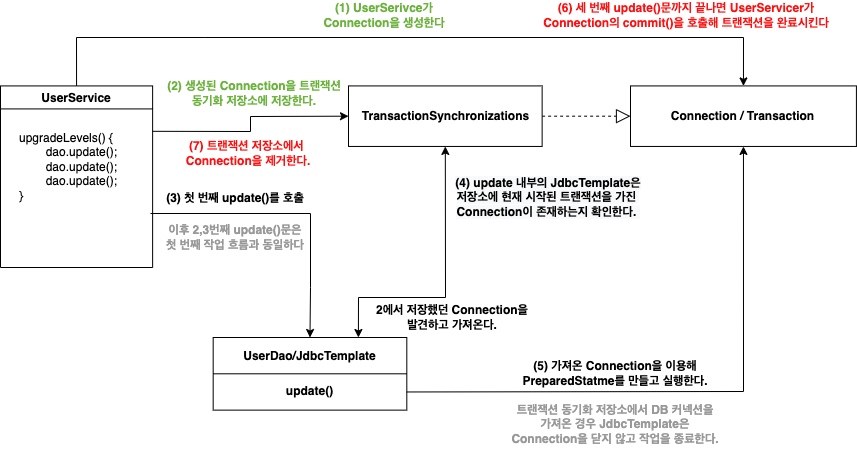

# 5장: 서비스 추상화

이번 장에서는 지금까지 작성한 DAO에 트랜잭션을 적용해보겠습니다.

---

### 1. 사용자 레벨 관리 기능 추가

- private static final in로 상수를 정의하는 것보단 enum을 활용하자.
- JDBC가 사용하는 SQL은 사실 컴파일 과정에서 검증되지 않는 단순 문자다.
    - 즉 문법 오류나 오타를 발견하는 것이 오직 사람의 몫이라는 것이다.
- 자 그렇다면 사용자를 관리하는 로직을 실제로 작성하자.
    - DAO는 데이터 액세스에 대한 책임이 있는 곳이지, 비즈니스 로직이 있을 곳은 아니다.
    - UserService로 네이밍하자. 어딘가 익숙하다.
- 본문에서 UserService.upgradeLevels() 메서드를 구현한 곳은 서비스 레이어다. 추후에 과연 도메인 모델과 분리되어 바뀔지 궁금하다.
- 그럼 그렇지, 코드 개선 부분이 나온다. 고려해야하는 항목은 아래와 같다.
    - 코드에 중복된 부분은 없는가?
    - 코드가 무엇을 하는 것인지 이해하기 불편하지 않은가?
    - 코드가 자신이 있어야 할 자리에 있는가?
    - 앞으로 변경이 일어난다면 어떤 것이 있을 수 있고, 그 변화에 쉽게 대응할 수 있게 작성되어 있는가?
- upgradeLevels() 리팩토링
    - ASIS
        
        ```java
        public void upgradeLevels() {
        		List<User> users = userDao.getAll();
        
        		for(User user : users) {
        				Boolean changed = null;
        				if(user.getLevel() == Level.BASIC && user.getLogin() >= 50) {
        						user.setLevel(Level.SILVER);
        						changed = true;
        				} else if(user.getLevel() == Level.SILVER && user.getLogin() >= 30){
        						user.setLevel(Level.GOLD);
        						changed = true;
        				} else if(user.getLevel() == Level.GOLD) {
        						changed = false;
        				} else {
        						changed = false;						
        				}
        
        				if(changed) {
        						userDao.update(user);
        				}
        		}
        }
        ```
        
        asis는 자주 변경될 가능성이 있는 구체적인 내용이 추상적인 로직의 흐름과 함께 섞여있다. 거기에 더해 if문이 레벨의 개수에 비례해 반복되기까지 한다. 수정해보자.
        
    - TOBE
        
        ```java
        public void upgradeLevels() {
        		List<User> users = userDao.getAll();
        		for(User user : users) {
        				if(canUpgradeLevel(user)){
        					upgradeLevel(user);
        				}
        		}
        }
        ```
        
        if 조건절과 레벨을 올리는 코드임이 명확히 드러나도록 구체적인 내용을 담아 함수명과 조건식을 작성했다. 여기서 추출된 메서드도 확인해보자.
        
        ```java
        private boolean canUpgradeLevel(User user){
        		Level currentLevel = user.getLevel();
        		switch(currentLevel) {
        				case BASIC: return (user.getLogin()) >= 50);
        				case SILVER: return (user.getRecommend()) >= 30);
        				case GOLD: return false;
        				default: throw new IllegalArgumentException(
        								"Unknown Level: " + currentLevel);
        		}
        }
        
        private void upgradeLevel(User user){
        		if(user.getLevel() == Level.BASIC) {
        				user.setLevel(Level.SILVER);
        		} else if(user.getLevel() == Level.SILVER) {
        				user.setLevel(Level.GOLD);
        		};
        		userDao.update(user);
        }
        ```
        
        그런데 upgradeLevel() 메서드를 잘 보면 여러가지 문제점들이 존재한다.
        
        - User 객체의 level 필드를 변환하는 로직이 그대로 노출하며 캡슐화를 위반한다.
        - level이 늘어날수록 조건문이 늘어나는 문제도 여전하다.
        - 즉 세부 구현에 대한 내용이 그대로 코드에 드러나있다.
- 자 리팩토링을 리팩토링해보자
    - 우선 레벨의 순서와 다음 단계를 결정하는 일은 Level이 할 수 있도록 위임해보자.
        
        ```java
        public enum Level {
        		GOLD(3, null), SILVER(2,GOLD), BASIC(1,SILVER);
        
        		private final int value;
        		private final Level next; // 다음 단계에 대한 정보를 스스로 갖고 있다.
        
        		Level(int value, Level next){
        				this.value = value;
        				this.next = next;
        		}
        
        		public int intValue(){
        				return value;
        		}
        
        		public Level nextLevel(){
        				return this.next;
        		}
        
        		public static Level valueOf(int value){
        				switch(value) {
        						case 1: return BASIC;
        						case 2: return SILVER;
        						case 3: return GOLD;
        						default: throw new AssertionError("Unknown value: " + value);
        				}
        		}
        }
        ```
        
        - UserService에서 레벨의 순서를 조건절을 통해 암시적으로 지정할 필요가 없다는 의미다.
        - 이는 비즈니스 로직에 조건절로 객체의 세부 구현을 명시한 것이나 다름이 없다.
    - 이전 코드에서는 UserService의 비즈니스 로직에서 레벨을 업그레이드하는 로직을 담고 있었다.
        - 자율적인 객체는 스스로의 상태를 스스로 제어해야 한다.
        - User 객체가 자신의 레벨을 스스로 올릴 수 있도록 책임을 위임하고 UserService는 메시지를 보내 협력하도록 변경하자.
        
        ```java
        public class User {
        		private Level level;
        		...
        		public void upgradeLevel() {
        				Level nextLevel = this.level.nextLevel(); // 킹스파?
        				if(nextLevel == null) {
        						throw new IllegalStateException(this.level + "은 업그레이드가 불가능합니다");
        				} else {
        						this.level = nextLevel;
        				}
        		}
        }
        ```
        
        - 이제 우린 Level의 다음 단계를 UserService의 비즈니스 로직을 통해 확인하지 않는다. Level 객체에게 다음 레벨이 무엇인지 메시지를 보내 처리한다. 자연스러운 캡슐화다.
        - User의 레벨을 올리는 것도 마찬가지다. 비즈니스 로직에서 User 객체의 내부 상태를 제어하지 않고, 메시지를 보내 요청한 뒤 User 객체가 스스로 내부 상태를 제어하도록 변경했다.
    - 결국 UserService는 아래처럼 간단해졌고, UserService가 갖고 있던 비즈니스 로직들은 각 객체들에게 적절히 분배되었다
        
        ```java
        public void upgradeLevel(User user) {
        		user.upgradeLevel();
        		userDao.update(user);
        }
        ```
        
        - if문장을 일일이 해석해가며 읽어야 했던 코드와 달리 각 객체가 어떤 역할을 하는지 명확히 드러난다.
        - 또한 세부 구현은 객체 뒤에 감춰졌고, 책임도 적절히 분배됐다.
- 이게 객체지향이다. 각 객체는 자신의 책임에만 충실하게 작업하며, 절대 다른 객체의 내부를 직접 헤집어놓지 않는다. 다른 객체가 해야할 일은 다른 객체에게 요청하면 그만이다. 이렇게 각자의 책임을 명확히 하고 원할한 협력 관계를 구성하는 것이 바로 객체지향이다.
    - 리팩토링을 하기 전 UserService는 객체지향이 전혀 아니다.
        - Level이 수행해야할 작업을 자신이 마음대로 가로채버리기도 하고
        - User 객체의 내부를 마음대로 헤집어 놓는다.
- 이전에 작성한 단위 테스트는 어떻게 변경할 수 있을까?
    - 역시 중복을 제거한다.
        - 숫자의 경우는 정수형 상수로 선언하자. 이를 통해 숫자에 의미를 부여할 수 있다.
        - 테스트에서는 가능한 경계 값을 사용하는게 좋다.

---

### 2. 트랜잭션 서비스 추상화

- 모든 트랜잭션은 시작과 끝이 있다는 사실을 명심하자.
    - 시작하는 법은 하나지만, 끝내는 방법은 두 개(commit, rollback)다.
    - JDBC는 DB 작업 후 자동으로 커밋되도록 설정되어 있다.
        - 이를 false로 변경해주면 새로운 트랜잭션이 시작될 수 있다.
        - 그리고 끝내지 않는 이상 여러 작업이 하나의 트랜잭션에 묶인다.
        - 그리고 작업 중 (기본적으로는 언체크) 예외가 발생하면 반영이 되지 않고 트랜잭션이 종료된다.
        - 이는 트랜잭션이 모두 성공하거나 모두 실패하는 성질인 원자성을 반영한다.
    - 이렇게 애플리케이션에서 트랜잭션이 시작되고 끝나는 지점을 트랜잭션의 경계라고 한다.
- 트랜잭션은 커넥션 안에서 만들어진다.
    - 템플릿 메서드가 호출될 때마다 트랜잭션이 새로 만들어지고, 메서드를 빠져나오기 전에 종료된다.
    - DAO 메서드를 하나씩 실행한다면 메서드 레벨에서 커넥션을 만들고 각각 독립적인 트랜잭션이 생성되고 종료된다. 하나의 트랜잭션으로 묶여서 동작하지 않는다는 의미다.
    - 트랜잭션을 하나로 묶는다는 것은 커넥션도 하나로 묶어야 한다.
- 이를 위해선 트랜잭션의 경계 설정 작업을 UserDao에서 UserService로 가져와야 한다.
    - 그래야만 UserService에서 하나로 묶인채 동작해야하는 비즈니스 로직을 트랜잭션의 라이프사이클과 동일하게 가져갈 수 있다.
    - 여기서 주의해야할 점은 UserDAO는 반드시 UserService의 메서드의 호출로 생긴 커넥션을 사용해야한다는 것이다. 그래야 동일한 트랜잭션 안에서 동작한다.
    - 결국 아래와 같은 코드가 되고, 앞서 가지고 있던 이점을 전혀 가지지 못하게 된다.
        
        ```java
        public class UserService {
        		public void upgradeLevels() throw Exception {
        				Connection c = ...;
        				...
        				// Transaction Start!!
        				try {
        						...
        						upgradeLevel(c,user);
        						...
        				}
        				// Transaction End!!
        				...
        		}
        }
        
        protected void upgradeLevel(Connection c, User u){
        		user.upgradeLevel();
        		userDao.update(c,user);
        }
        ```
        
        - DB 관련 리소스를 깔끔하게 처리하는 것을 가능하게 해준 JdbcTemplate을 더이상 활용할 수 없다.
        - 트랜잭션을 이어지게 하려면 메서드 내부에서 계속 커넥션을 전달해줘야 한다. 심지어 UserService는 빈이기 때문에 상태를 가지면 안된다는 점때문에 인스턴스 필드에 넣어놓을 수도 없다.
        - 데이터 액세스 기술이 변하면 Connection이 아닌 EntityManager나 Session을 메서드 파라미터에서 변경해줘야 한다.
- 스프링은 이 문제를 어떻게 해결할까
    - 우선 트랜잭션의 경계 설정은 피할 수 없는 것이다. 즉 UserService에서 반드시 커넥션을 생성하고 트랜잭션의 라이프사이클이 관리되어야 한다는 점은 변하지 않는다는 의미다.
    - 다만 우리가 수정하고자 하는 것은 커넥션이 이리저리 움직이는 것이다.
    - 여기서 스프링은 독립적인 **트랜잭션 동기화 방식(Transaction synchronization)**을 제안한다.
        - UserService에서 커넥션이 생성되는 것은 막을 수 없으니 생성된 이놈을 임시 똑딱이 텐트에 잠시 맡겨놓고 DAO는 필요할 때 꺼내쓰자는 것이다.
        - 정확하게는 DAO가 사용하는 JdbcTemplate이 트랜잭션 동기화 방식을 이용하게 하는 것이다.
        - 위 방식은 아래와 같은 흐름을 보여준다.
- 스프링이 제공하는 트랜잭션 동기화 방식의 동작 흐름은 아래와 같다.
    
    <p align="center"></p>
    
    - 이 과정에서 만약 예외 상황이 발생하면 UserService는 즉시 Connection의 rollback()을 호출해 트랜잭션을 종료한다.
        - 이 때도 당연히 저장소에 있는 Connection은 재거해야한다.
        - 트랜잭션 동기화 저장소는 작업 스레드마다 독립적으로 Connection 오브젝트를 저장, 관리한다.
        - 멀티 스레드 환경에서 충돌이 날 염려가 없다.
- 그런데 어떻게 멀티 스레드 환경에서 안전한 것일까? 확인해보자.
    - 스프링이 제공하는 트랜잭션 동기화 관리 클래스는 TransactionSynchronizationManager다.
    - 이 클래스를 통해 트랜잭션 동기화 작업을 초기화하도록 요청하고, DataSourceUtils에서 제공하는 getConnection() 메서드를 통해 DB 커넥션을 생성한다.
    - 이 메서드를 사용하는 이유는 DataSource에서 커넥션을 직접 가져오는 것이 아닌, 커넥션을 생성하고 트랜잭션 동기화에 사용할 수 있도록 저장소에 바인딩해주기 때문이다.
        - 이 때 동기화 준비가 완료되면 트랜잭션을 시작한다. 이 상태에서 JdbcTemplate을 사용하면 JdbcTemplate의 작업에서 동기화시킨 DB 커넥션을 사용하게 된다.
        - 즉 맨 처음 upgradeLevel() 메서드에서 생성한 트랙잭션에 upgradeLevel()에서 호출하는 JdbcTemplate.update() 메서드가 참여한다.
    - 아래는 upgradeLevels를 트랜잭션 동기화 방식으로 바꾼 코드다.
        
        ```java
        public class UserService {
        		public void upgradeLevels() throw Exception {
        			
        				// 트랜잭션 동기화 관리자를 통해 동기화 작업을 초기화한다.
        				TransactionSynchronizationManager.initSynchronization();
        
        				// DataSourceUtils을 통해 DB 커넥션을 생성한다
        				// 이를 통해 이후의 DAO 작업은 여기서 시작한 트랜잭션으로 묶인다
        				Connection c = DataSourceUtils.getConnection(dataSource); // DB 커넥션 생성과 동기화를 함께 해준다
        				c.setAutoCommit(false) // 트랜잭션 시작을 선언한다
        
        				try {
        						...
        						upgradeLevel(user);
        						...
        						c.commit(); // 정상적으로 작업을 종료한 경우 트랜잭션을 커밋한다		
        				} catch(Exception e) {
        						c.rollback(); // 예외가 발생한 경우 롤백
        						throw e;
        				} finally {
        						// 스프링 유틸리티 메서드를 이용해 DB Connection을 안전하게 닫는다
        						DataSourceUtils.releaseConnection(c, dataSource);
        
        						// 트랜잭션 동기화 작업을 종료하고 정리한다
        						TransactionSynchronizationManager.unbindResource(this.dataSource);
        						TransactionSynchronizationManager.clearSynchronization();
        				}
        		}
        }
        ```
        
- 그런데 JdbcTemplate은 어떻게 동작하는 걸까? 왜 우린 UserService에서 트랜잭션 동기화 관리자를 통해 커넥션을 생성하고 동기화 작업을 선행해줬을까?
    - 사실 JdbcTemplate은 트랜잭션 동기화 저장소를 확인하는 절차를 가진다.
        - 만약 여기에 DB 커넥션이나 트랜잭션이 없으면 직접 커넥션을 생성하고, 트랜잭션을 시작한다.
        - 하지만 앞선 UserService의 upgradeLevels() 처럼 미리 트랜잭션 동기화 매니저를 통해 커넥션을 생성하고 동기화를 시작하는 경우라면
        - 위처럼 동작하지 않고 미리 저장해놓은 커넥션을 사용한다. 즉 앞서 말한듯 기존에 생성된 트랜잭션에 참여한다.
- 글로벌 트랜잭션이 필요한 상황이 생겼다. 자세한 설명은 11장에서 진행하고 여기서 키포인트는 UserDao가 DAO 패턴을 사용해 얻었던 유연성을 토해내야 한다는 것이다.
    - 그 이유는 UserService에 등장한 트랜잭션 코드때문이다.
        - 만약 구현 기술이 바뀐다면? 글로벌 트랜잭션은 우리가 생성한 코드와 다르고 JPA도 다르다. 결국 구현 기술에 종속적인 코드가 되버린 것이다.
    - 심지어 트랜잭션의 경계는 이전과 동일하게 유지해야 한다. 트랜잭션 경계 설정을 위한 코드를 버릴 순 없다는 의미다.
    - 이럴 땐 어떻게 해야할까? 기존처럼 OCP 원칙을 지키는 코드로 어떻게 만들 수 있을까?
- 정답은 추상화다. SQL을 사용한다는 공통점은 JDBC로 추상화했으니, 트랜잭션 처리도 추상화할 수 있지 않을까?
    - JDBC, JTA, 하이버네이트, JPA 모두 트랜잭션 개념을 갖고 있지 않는가
    - 역시 스프링은 트랜잭션 추상화 기술을 제공한다. 바로 PlatformTranscationManager 인터페이스다.
    - UserService 코드에 적용해보자.
        
        ```java
        public class UserService {
        		public void upgradeLevels() throw Exception {
        
        				// JDBC에 대한 추상 오브젝트를 생성한다.
        				PlatformTransactionManager transactionManager = new DataSourceTransactionManager(dataSource);
        				TransactionStatus status = transactionManager.getTransaction(new DefaultTransactionDefinition());
        
        				try {
        						...
        						upgradeLevel(user);
        						...
        						trasactionManager.commit(status); 
        				} catch(Exception e) {
        						trasactionManager.rollback(status); 
        						throw e;
        		}
        }
        ```
        
        - 스프링이 제공하는 추상 인터페이스는 PlatformTransactionManager이며, 우리는 JDBC 로컬 트랜잭션을 이용하기 때문에 DataSourceTransactionManager를 사용했다.
        - 순수 JDBC에서는 Connection을 먼저 생성하고 트랜잭션을 시작했지만
        - PlatformTransactionManager에서는  getTransaction() 메서드를 통해 트랜잭션을 가져온다. 이 때 필요에 따라 커넥션도 같이 가져온다. 트랜잭션을 시작한다는 의미로 받아들이자.
        - JDBC에서는 커넥션의 AutoCommit을 false로 바꿨었다는 것도 잊지말자.
        - 이 후 트랜잭션 동기화 저장소에 저장하고 꺼내오는 작업은 전과 동일하다.
    - 이 경우 글로벌 트랜잭션이나 하이버네이트로 바꾸고 싶다면 PlatformTransactionManage에 new 연산자로 해당하는 구체 클래스만 생성해서 넣어주면 된다.
        - 하지만 지금 상태는 약간으 문제가 있다. 바로 DI 원칙을 위배한다.
        - PlatformTransactionManager가 어떤 구체 클래스를 사용할지 UserService가 직접 결정하기 때문이다.
        - 이럴 땐 역시 클라이언트를 사용해서 의존성을 주입하도록 변경하면 된다.
        - 그러기 위해선 스프링 컨테이너에 빈으로 등록해주면 된다. 여기서 조심해야할 건 멀티 스레드 환경에서 싱글톤으로 동작해도 이슈가 발생하지 않을만한지 확인하는 것이다.
- 다행히도 PlatformTransactionManage의 구현 클래스는 싱글톤으로 사용해도 이상이 없다. 주입받도록 코드를 변경해보자.
    
    ```java
    public class UserService {
    		
    		private PlatformTransactionManager transactionManager;
    
    		public void setPlatformTransactionManager(PlatformTransactionManager ****transactionManager){
    				this.transactionManager = transactionManager;
    		}
    
    		public void upgradeLevels() throw Exception {
    
    				// JDBC에 대한 추상 오브젝트를 생성한다.
    				PlatformTransactionManager trasactionManager = new DataSourceTransactionManager(dataSource);
    				TransactionStatus status = trasactionManager.getTransaction(new DefaultTransactionDefinition());
    
    				try {
    						...
    						upgradeLevel(user);
    						...
    						this.transactionManager.commit(status); 
    				} catch(Exception e) {
    						trasactionManager.rollback(status); 
    						throw e;
    		}
    }
    ```
    

---

### 3. 서비스 추상화와 단일 책임 원칙

- 지금까지 해온 작업들을 가볍게 정리해보자.
    - 우리는 스프링에서 제공하는 트랜잭션 추상화 기술을 사용해 UserService는 비즈니스 로직만 작성할 수 있도록 했고, UserDao는 데이터 액세스에 관련된 로직만 작성하도록 했다.
    - 또한 스프링이 제공하는 DataSource, PlatformTransactionManager를 활용해 DB 커넥션 생성과 트랙잭션 동기화에 대한 관심사를 애플리케이션 코드와 분리해내었다.
    - 그리고 이 모든 것은 스프링 컨테이너를 통한 DI와 인터페이스의 적절한 활용이 있었기에 가능했다.
    - 자 그렇다면 이것만큼 중요한 원칙인 단일 책임 원칙을 알아보자.
- 단일 책임 원칙은 우리가 앞서 해온 관심사의 분리와 밀접한 연관이 있다.
    - 글자 그대로 해석하면 하나의 모듈은 하나의 책임을 가져야 한다는 의미다. 여기서 책임은 사실 ‘변경 이유'라고 해석하는 것이 훨씬 이해가 쉽다.
    - UserService에 트랜잭션 관련 코드가 들어가있었을 때 UserService가 변경될 이유는 두 가지였다.
        - 사용자 레벨을 관리하는 관심사: 레벨 업그레이드에 필요한 조건이 변경된다면?
        - 트랜잭션을 관리하는 관심사: 서버 환경이 바뀌어 트랜잭션 기술을 변경해야 한다면?
    - 트랜잭션 추상화를 통해 관심사가 분리된 이후 UserService가 바뀔만한 이유는 단 하나, 사용자 레벨 관리에 대한 내용뿐이다.
    - 따라서 이는 단일 책임 원칙을 충실히 지킨다고 얘기할 수 있다.
- 사실 이러한 원칙들을 지키고자 하는 궁극적인 목적은 바로 “변경”이다.
    - 실무에서 사용하는 애플리케이션에 만약 한 가지 변경으로 인해 수백군데 수정이 일어난다고 생각해봐라. 얼마나 끔찍한가.
    - 객체지향은 사실 책임과 관심사가 다른 코드를 분리해서, 변경 시 수정해야하는 부분을 최소한으로 줄이기 위해 탄생한 것이다.
    - 그리고 이것이 가능하도록 하는 것이 바로 스프링 컨테이너를 통한 DI다.
    - DI는 정말 중요하다. 1장에서 진행한 UserDao와 DaoFactory, JdbcTemplate이 사용하는 템플릿/콜백 패턴, 트랜잭션 기술 추상화조차 DI를 사용했다.