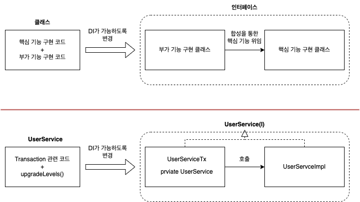
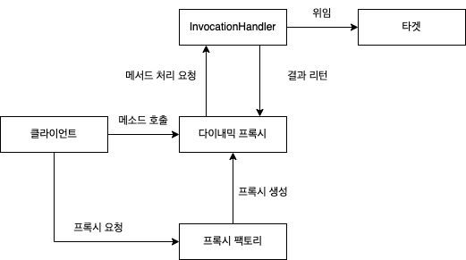

# 6장: AOP

- AOP가 무엇이고, 왜 등장한 것일까.
- 가장 인기있는 AOP 적용 대상은 단언코 선언적 트랜잭션 기능이다. 앞선 5장에서는 서비스 추상화를 통해 트랜잭션 경계 설정의 근본적인 문제를 해결했었다.
- 이번엔 AOP를 통해 바꿔보자. 그리고 거기서 why도 확인하자.

---

### 1. 트랜잭션 코드의 분리

- 우리가 앞서 UserService에 작성한 코드는 다음과 같은 특징을 갖는다.
    - 트랜잭션 경계설정 코드와 비즈니스 로직 코드는 서로 주고받는 정보가 없다.
    - 또한 둘의 경계가 뚜렷하게 구분된다.
    - 그렇다면 이를 분리할 수 있지 않을까?
        
        ```java
        // 트랜잭션 경계 설정 코드
        public void upgradeLevels() throws Exception {
        		TransactionStatus status = trasactionManager.getTransaction(new DefaultTransactionDefinition());
        		
        		try {
        				upgradeLevelsIntenal();
        				this.trasactionManager.commit(status);
        		} catch (Exception e) {
        				this.trasactionManager.rollback(status);
        				throw e;
        		}
        }
        
        // 비즈니스 로직
        private void upgradeLevelsIntenal() {
        		...
        }
        ```
        

- 비즈니스 로직 코드를 별도의 메서드로 분리했다. 그렇다면 이를 사라지게 할 수 있을까?
    - 트랜잭션 경게 설정 코드를 클래스 밖으로 뽑아버리자.
    - 그런데 이렇게 트랜잭션을 클래스 밖으로 뽑으면 다른 클래스가 UserService.upgradeLevels()를 사용할 때 트랜잭션이 없는 상태로 사용하게 된다.
        - 지금은  UserServiceTest가 UserService를 사용할 때 직접 구체 클래스를 참조한다. 이 때문에 클라이언트(UserServiceTest)와 강한 결합도가 존재한다.
    - 이것이 바로 구체적인 구현 클래스를 직접 사용할 때의 문제점이다.

- 이를 해결하기 위해 우린 DI를 통해 결합도를 낮게 유지할 수 있으며, 인터페이스를 사용할 수 있었다.
    - 우리가 보통 인터페이스를 사용한 이유는 런타임에 구체 클래스를 바꾸기 위함이었다.
    - 하지만 이렇게 생각해보자.
        - 우리는 책임을 둘로 나눴다. 트랜잭션 코드에 대한 책임과, 비즈니스 로직에 대한 책임으로
        - 이 둘은 결국 같이 실행되어야 하며, 비즈니스 코드는 트랜잭션 내부에서 실행되어야 한다.

- 그렇다면 트랜잭션 경계를 설정하는 구체 클래스가 트랜잭션 경계 설정을 한 뒤, 비즈니스 로직을 담당하는 구체 클래스를 호출하면 되지 않나?
    - 자, 트랜잭션 코드를 담당하는 UserService 구현 클래스가 비즈니스 로직 코드를 담당하는 UserService를 호출하도록 해보자.

- 우선 기존 UserService 구현체는 인터페이스를 구현해야 하므로 이름을 변경하자. 그리고 비즈니스 로직과 트랜잭션 경계 설정을 구현하는 구체 클래스를 생성해보자.
    
    ```java
    // 트랜잭션을 설정하는 코드는 메서드의 세부 구현이라는 사실을 잊지 말자
    public interface UserService {
    		void add(User user);
    		void upgradeLevels();
    }
    
    // 비즈니스 로직 코드를 구현한 구체 클래스
    public class UserServiceImpl implements UserService {
    		UserDao userdao;
    		MailSender mailSender;
    
    		publc void upgradeLevels() {
    				...
    				// 비즈니스 로직
    		}
    }
    ```
    
    ```java
    public class UserServiceTx implements UserService {
    		// UserServiceTx가 트랜잭션 경계 설정을 한 뒤 비즈니스 로직을 호출할 UserService 구현체다.
    		UserService userService;
    
    		// 트랜잭션 경계 설정에 필요한 Transactional Manager
    		PlatformTransactionManager transactionManager;
    
    		public void setTransactionalManager(PlatformTransactionManager transactionManager) {
    				this.transactionManager = transactionManager
    		}
    
    		public void setUserService(UserService userService) {
    				this.userService = userService
    		}
    
    		public void add(User user) {
    				this.userService.add(user);
    		}
    
    		public void upgradeLevels() {
    				// UserServiceTx의 트랜잭션 경계 설정 로직
    				TransactionStatus status = this.trasactionManager.getTransaction(new DefaultTransactionDefinition());
    				
    				try {
    						// UserServiceImpl 비즈니스 로직 시작
    						this.userService.upgradeLevels(); 
    						// UserServiceImpl의 비즈니스 로직 끝
    					
    						this.transactionManager.commit();
    				} catch (RuntimeException e) {
    						this.transactionManager.rollback();
    						throw e;
    				}
    		}
    }
    ```
    

- 이렇게 함으로써 우리가 얻는 장점이 무엇일까?
    - 우리는 이제 트랜잭션 코드와 비즈니스 로직을 완전히 분리했다.
    - 또한 클라이언트는 구체 클래스가 아닌 인터페이스에 의존한다
    - 우리가 만약 비즈니스 로직을 추가하고 싶다면 UserServiceImpl만 건들면 된다. 이것은 단일 책임 원칙과도 상응한다.
    - 스포일러긴 하지만, 항상 이렇게 스프링은 객체지향의 원칙을 자연스럽게 반영한다. 또한 개발자가 비즈니스 로직에만 집중할 수 있도록 도와준다.

---

### 3. 프록시와 프록시 패턴, 데코레이터 패턴

- 우리는 앞서 확장성을 고려해 기능을 분리할 때 전략 패턴을 사용했고, 트랜잭션 관련 코드를 클래스 밖으로 꺼내 둘을 분리할 수 있었다.
    - 이 때 우리가 기억해야할 것은 부가 기능을 하는 클래스가 핵심 기능을 하는 클래스를 호출해 전체 기능을 수행한다는 사실이다.
    - 하지만 이 때의 문제점은 앞서 핵심 기능을 수행했던 UserService가 직접 호출해버리는 경우에는 부가 기능이 제외된다는 것이다. 이 경우는 어떻게 해야할까?

- 이 때 필요한 건 사실 거창한 것이 아닌 눈속임이다. 부가 기능을 핵심 기능처럼 둔갑시키면 된다. 이러한 눈속임 역시도 인터페이스를 통해 가능하다.
    - 이렇게 클라이언트가 사용하려는 클래스인 것처럼 위장해 요청을 대신 받는 역할을 ‘프록시’라고 부른다.
    - 그리고 이 프록시를 통해 실제 핵심 로직을 수행하는 오브젝트를 ‘타겟'이라고 한다.
    - 기존 구조는 위 그림처럼 ***클라인트 → 핵심 기능 인터페이스(부가 기능 구현 클래스) → 핵심 기능 인터페이스 (핵심 기능 구현 클래스)*** 로 동작했다면
    - 프록시를 적용하고 난 뒤에는 ***클라이언트 →프록시 → 타깃*** 구조로 동작한다.
        
         <p align="center"></p>
        

- 이렇듯 핵심 기능에 부가적인 기능을 프록시를 통해 런타임에 동적으로 부여해주는 패턴을 데코레이터 패턴이라 부른다.
    - 동적으로 부여해준다는 것은 컴파일 시점의 의존성이 구체 클래스에 묶여있지 않다는 뜻이다.
        - 데코레이터 패턴은 인터페이스를 통해 기능을 다른 클래스로 위임하기에 이것이 가능하다.
    - 이는 앞서 인터페이스를 사용해 전략 패턴으로 클래스 구조를 작성했을 때에도 확인했었다.

- 대표적으로 Java IO 패키지의 InputStream과 OutputStream 구현 클래스가 있다.
    
    > 다음 코드는 InputStream이라는 인터페이스를 구현한 타깃인 FileInputStream에 버퍼 읽기 기능을 제공해주는 BufferedInputStream이라는 데코레이터를 적용한 예다.
    
    `InputStream is = new BufferedInputStream(new FileInputStream(”file.txt”));`
    > 
    - 이러한 데코레이터 패턴 역시 스프링 DI를 적용하면 아주 편리하게 구성할 수 있다.

- 프록시와 프록시 패턴은 다르다.
    - 프록시는 앞서 말한 위장을 통해 대리인의 역할을 수행하는 인다이렉션을 생성하는 것이라면
    - 프록시 패턴은 위에서 언급한 프록시를 사용하는 법 중 타깃에 대한 접근 방법을 제어하려는 목적인 경우를 말한다.
    - 당장 타깃 오브젝트가 필요하지 않아 추후 생성하는 것이 좋을 때나 원격 오브젝트를 사용하려는 때, 타깃의 접근 권한을 제어하기 위한 때에 유용하다.

- 프록시와 데코레이터 패턴은 유사한 점이 많지만 사용 목적에 따라 분리하면 쉽다.
    - 접근 방법의 제어를 위한 것인가?
    - 혹은 기능을 더하기 위함인가?

- 그런데 생각보다 개발자들은 프록시를 만들기 싫어한다. 왜? 번거롭기 때문이다. 앞선 UserService 예제로 확인해보자.
    - 구현 클래스 외에도 타겟의 인터페이스를 메서드까지 모조리 재정의해줘야 한다. 심지어 부가기능이 필요하지 않은 경우라도.
        - UserServiceTx, UserServiceImpl은 UserService의 구현체다. 따라서 만약 delete() 메서드가 추가되는 경우 트랜잭션이 필요없더라도 UserServiceTx에 구현해줘야 한다.
    - 또한 부가 기능 코드의 중복이 발생한다.
        - 만약 UserServiceTx에 존재하는 add()에도 트랜잭션 기능이 추가되어야 한다면? 똑같이 TransactionalStatus, TransactionManager 등 관련 코드를 작성해줘야 한다.
    - 그렇다면 이 문제를 해결할 수 있을까? 1번은 어찌 분리를 통해 가능하더라도 2번 문제는 쉽지 않다.
    - 해결 방법은 바로 JDK의 다이내믹 프록시다.

- 다이내믹 프록시의 동작 기반은 리플렉션이다.
    - 리플렉션은 자바의 특성을 활용한 기능이다.
        - 자바의 모든 클래스는 스스로의 런타임 클래스를 반환해주는 getClass() 메서드를 갖고 있다.
            
            ```java
            public class GetClassTest {}
            public class ExtendedGetClassTest extends GetClassTest {}
            
            @DisplayName("getClass() 메서드가 런타임 클래스를 반환하는가")
            @Test
            public void test_when_getClass_on_extendedObj_then_return_runtime_class(){
            		// given
                GetClass getClassTestStub = new GetClass();
                GetClass extendedGetClassStub = new ExtendedGetClass();
            
                // when
                Class<? extends GetClass> getClass = getClassTestStub.getClass();
                Class<? extends GetClass> extendedGetClass = extendedGetClassStub.getClass();
            
                // then
                assertThat(getClass).isEqualTo(GetClass.class); // true
                assertThat(extendedGetClass).isEqualTo(ExtendedGetClass.class); // true
            }
            ```
            
        - 또는 ClassName.class를 통해 Class<T> 형태의 오브젝트를 가져올 수 있다.
    - 해당 오브젝트의 메서드까지 가져올 수 있다.
        
        ```java
        public class ReflectionTest {
        
            public String returnSayIt(){ return "sayIt"; }
        
            @Test
            public void testClass() throws Exception {
                // given
                ReflectionTest obj = new ReflectionTest();
                Method sayItMethod = ReflectionTest.class.getMethod("returnSayIt");
        
                // when
                String invoke = (String) sayItMethod.invoke(obj);
        
                // then
                assertThat(invoke).isEqualTo("sayIt");
            }
        }
        ```
        
    - 리플렉션은 이만하면 됐다. 이제 다이내믹 프록시를 이용해서 프록시를 만들어보자.
    
- 우선 일반적인 프록시 클래스를 하나 만들고 이를 다이나믹 프록시 구조로 변경해보자.
    - 먼저 데코레이터 패턴에서 핵심 기능 인터페이스 역할을 하는 Hello다.
        
        ```java
        public interface Hello {
        
            String sayHello(String name);
            String sayHi(String name);
            String sayThankYou(String name);
            String sayGoodOnLowerCase(String name);
        }
        ```
        
    - 다음으로는 와 부가 기능, 핵심 기능 구현체다.
        
        ```java
        public class HelloTarget implements Hello{
        
        		@Override
        		public String sayHello(String name) {
        		    return "Hello " + name;
        		}
        		
        		@Override
        		public String sayHi(String name) {
        		    return "Hi " + name;
        		}
        		
        		@Override
        		public String sayThankYou(String name) {
        		    return "Thank you " + name;
        		}
        
        		@Override
            public String sayGoodOnLowerCase(String name) {
                return "Good " + name;
            }
        }
        ```
        
        ```java
        public class HelloUppercase implements Hello {
            private Hello helloTarget; // 타겟 오브젝트, 프록시 교체 우려가 있으니 인터페이스로 접근하자.
        
            public HelloUppercase(HelloTarget helloTarget) {
                this.helloTarget = helloTarget;
            }
        
            @Override
            public String sayHello(String name) {
                return helloTarget.sayHello(name).toUpperCase(); // 부가 기능 toUpperCase()가 반복
            }
        
            @Override
            public String sayHi(String name) {
                return helloTarget.sayHi(name).toUpperCase(); // 부가 기능 toUpperCase()가 반복
            }
        
            @Override
            public String sayThankYou(String name) {
                return helloTarget.sayThankYou(name).toUpperCase(); // 부가 기능 toUpperCase()가 반복
            }
        
            @Override
            public String sayGoodOnLowerCase(String name) {
                return helloTarget.sayGoodOnLowerCase(name); // 부가 기능을 사용하지 않음에도 불구하고 구현해줘야 하는 문제
            }
        }
        ```
        
        - 부가 기능 구현체를 보면 아까 말했듯 2가지 문제가 나타나고 있다. 겨우 4개의 메서드인데도 이렇게 반복되고 헷갈린다.
        
- 다이나믹 프록시는 위 문제를 어떻게 해결할까?
    - 아래는 다이내믹 프록시의 동작 구조다. 기존 데코레이터 패턴과 어디가 다른지 확인해보자.
        
        <p align="center"></p>
        
    - 우선 다이내믹 프록시 오브젝트는 프록시 팩토리에 의해서 생겨나며, 런타임 시에 다이내믹하게 생성된다.
        - ***이를 통해 우리는 타겟의 인터페이스를 매번 일일히 구현해줘야 하는 문제점을 해결할 수 있다. 왜? 프록시 팩토리가 만들어주니까***
        - 이전 구조가 실제 인터페이스를 생성한 뒤 구현하고, 생성해 호출했던 것과 달리 인터페이스를 프록시 팩토리에게 전달하며 다이나믹 프록시를 생성해달라고 요청하면 끝이다.
    - 그리고 클라이언트가 타겟에게 메서드를 호출하는 것처럼 느껴지게, 타겟의 인터페이스과 같은 타입으로 만들어진다. 위에서 위장을 통해 클라이언트를 눈속임한다고 했던 것과 동일하다.
    - 아까 getClass()가 런타임 클래스를 가져온다고 했던 것을 기억하라.
    - 물론 우리가 필요한 부가기능까지 만들어주는 것은 아니다. 해당 부가기능은 우리가 InvationHandler를 구현한 오브젝트에 작성해줘야 한다.
    - 이후 다이내믹 프록시 오브젝트는 InvocationHandler 구현체가 갖는 invoke() 메서드에 클라이언트의 요청을 리플렉션 정보로 변환해 넘겨준다.
    - 여기서 아까 우리가 리플렉션을 언급한 이유가 나온다. InvacationHandler 인터페이스의 메서드 API 문서의 첫 문단에 아래와 같이 작성되어 있다.
        
        > ***InvocationHandler is the interface implemented by the invocation handler of a proxy instance.***
        
        *InvocationHandler는 프록시 인스턴스의 invocation 핸들러에 의해 구현되는 인터페이스입니다.*
        > 
        
        여기서 invocation은 호출이라는 의미로 사용된다.위 문장을 간략히 해석해보면 InvocationHandler 인터페이스의 구현체는 프록시 인스턴스의 호출을 핸들링하는 객체라고 볼 수 있다.
        
    - 종합해보면 클라이언트는 다이내믹 프록시의 메서드를 호출하고, 다이내믹 프록시는 타겟 클래스 메서드를 호출하는 InvocationHandler의 구현체의 invoke()를 다시 호출하는 형태로 이뤄진다. 그리고 invoke()를 호출할 때는 클라이언트의 요청 정보를 넘겨준다.
        - 이를 통해 아무리 핵심 기능 인터페이스(Hello)에 정의된 기능이 많아도 invoke 하나로 모두 호출할 수 있다.
    - 결국은 모든 기능은 InvocationHandler(부가 기능 담당) + 타겟(핵심 기능 담당)을 통해 수행되는 것이다.

- 위 과정을 정리해보면 데코레이터 패턴은 ***클라이언트 → 프록시 → 타겟  동작*** 구조를 갖지만, 다이내믹 프록시를 도입하며 ***클라이언트 → 다이내믹 프록시 → InvocationHandler → 타겟***  으로 동작 구조가 변경됐다.
    - 아래는 위 과정을 표시한 동작 순서다.
        
        <p align="center"></p>
        
- 이제 다이내믹 프록시, InvocationHandler의 구현체를 만들어보자.
    - 첫 번째는 프록시 팩토리를 통해 다이내믹 프록시를 생성하는 부분이다.
        - 앞선 내용에서 프록시 팩토리가 다이내믹 프록시를 생성하기로 되어 있었던 것을 기억하는가?
        - 아래 코드에서는 Proxy 클래스의 newProxyInstance 팩토리 메서드를 프록시 팩토리로 사용해 다이내믹 프록시를 생성하고 있다.
        
        ```java
        public Hello getDynamicProxyFromProxyFactory() {
        		return (Hello) Proxy.newProxyInstance( // 다이내믹 프록시의 생성을 담당하는 프록시 팩토리
                    getClass().getClassLoader(),
                    new Class[] {Hello.class}, // 구현할 인터페이스의 클래스
                    new UppercaseHandler(new HelloTarget())
            );
        }
        ```
        
    - 두 번째는 InvationHandler의 구현 클래스다.
        - 구조도를 다시 살펴보면 InvocationHandler는 다이내믹 프록시의 메서드 처리 요청을 받고
        - 타겟에게 핵심 기능을 위임한 뒤 결과값을 전달받아 자신의 부가기능을 더해 다이내믹 프록시에게 반환한다.
        
        ```java
        public class UppercaseHandler implements InvocationHandler {
        		// 타겟
            private Hello target;
        
        		// 다이내믹 프록시에게 전달받은 메서드 처리 요청을 
        		// 타겟으로 위임하기 위해 타겟을 주입받아놓는 역할
            public UppercaseHandler(Hello target) {
        	        this.target = target;
            }
        
            @Override
            public Object invoke(Object proxy, Method method, Object[] args) throws Throwable {
        				// target의 method를 invoke(호출)하여 기능을 위임
                String ret = (String)method.invoke(target, args); 
        
                return ret.toUpperCase(); // 부가 기능을 invoke 메서드에서 작성
            }
        }
        ```
        
    - 우린 위 과정을 통해 프록시 팩토리를 통해 오브젝트가 생성되기 때문에 메서드 수가 늘어나도  직접 구현해야할 필요가 없어졌다.
    - 하지만 한 가지 주의해야할 점이 있다. 바로 리턴 타입이다.
        - 우리는 sayHello, sayHi, sayThankYou의 리턴 타입이 모두 String 이었기 때문에 invoke() 메서드의 리턴 타입을 String으로 명시적 형변환을 시켰다.
        - 하지만 만약 새롭게 추가된 메서드가 리턴 타입을 String으로 갖지 않는다면 오버라이딩된 invoke() 메서드는 런타임에서 캐스팅 오류를 뱉을 것이다.
        - 따라서 이 부분은 아래와 같이 수정해줄 필요가 있다.
            
            ```java
            public class UppercaseHandler implements InvocationHandler {
            
                private Object target;
            
                public UppercaseHandler(Object target) {
            	        this.target = target;
                }
            
                @Override
                public Object invoke(Object proxy, Method method, Object[] args) throws Throwable {
            				// target의 method를 invoke(호출)하여 기능을 위임
                    Object ret = method.invoke(target, args); 
            				
            				// 부가기능을 적용할 조건(method name: say*)의 추가도 가능하다. 모든 메서드에 부가 기능을 붙히고 싶지 않을 때 유용하다
            				if(ret instanceof String && method.getName().startsWith("say"){ 
            						return ((String)ret).toUpperCase();
            				} else {
            						return ret;
            				}
                }
            }
            ```
            

- 자 이제 기본적인 데코레이터 패턴에서 다이내믹 프록시를 이용해 어떤 이점을 가질 수 있는지를 확인하고 실제로 변경해보았다. 이제 시작점인 UserServiceTx로 돌아가 해결해보자.
    - 트랜잭션 부가 기능을 담는 InvocationHandler 구현체다.
        
        ```java
        public class TransactionHandler implements InvocationHandler {
        		private Object target; // 부가 기능이 더해질 타겟 오브젝트
        		private PlatformTransactionManager transactionManager; // 부가 기능(트랜잭션)을 제공할 떄 필요한 트랜잭션 매니저
        		private String pattern; // 트랜잭션을 적용할 메서드 이름 패턴
        
        		public void setTransactionManager(PlatformTransactionManager transactionManager) {
        				this.transactionManager = transactionManager;
        		}
        
        		public void setPattern(String pattern) {
        				this.pattern = pattern;
        		}
        
        		public Object invoke(Object proxy, Method method, Object[] args) throws Throwable {
        				if(method.getName().startsWith(pattern){ 
        						return invokeInTransaction(method, args); // 메서드 이름이 패턴에 일치하는 경우만 트랜잭션 부가 기능 붙이기
        				} else {
        						return method.invoke(target, args);
        				}
        		}
        
        		private Object invokeInTransaction(Method method, Object[] args) throws Throwable {
        				TransactionStatus status = this.transactionManager.getTransaction(new DefaultTransactionDefinition());
        
        				try {
        						Object ret = method.invoke(target, args);
        						this.transactionManager.commit(status);
        						return ret
        				} catch (InvocationTargetException e){
        						this.transactionManager.rollback(status);
        						throw e.getTargetException();
        				}
        		}
        }
        ```
        
    - 코드를 쭉 살펴보면 Hello에 적용한 것과 상당히 비슷하다.
    - 차이점이 있다면 트랜잭션을 다루기 위한 트랜잭션 매니저를 주입받는 부분과 부가 기능을 부여하기 위한 메서드의 이름 패턴을 인자로 주입받는 정도이다.
    - 나머지는 이전처럼 패턴을 통해  메서드를 선별해 부가 기능을 부여하고 있다.
    - 그리고 중요한 차이점이 하나가 있는데, invoke()를 통해 타겟 오브젝트의 메서드가 실행되었을 때 예의가 발생하면 해당 예외는 InvocationTargetException로 래핑되어 나온다. 따라서 rollback을 위한 예외를 캐치할 때 위 예외를 확인해야 한다.
        
        ```java
        Caused by: java.lang.reflect.InvocationTargetException
        	at java.base/jdk.internal.reflect.NativeMethodAccessorImpl.invoke0(Native Method)
        	at java.base/jdk.internal.reflect.NativeMethodAccessorImpl.invoke(NativeMethodAccessorImpl.java:62)
        	at java.base/jdk.internal.reflect.DelegatingMethodAccessorImpl.invoke(DelegatingMethodAccessorImpl.java:43)
        	at java.base/java.lang.reflect.Method.invoke(Method.java:566)
        	at part6.hello.dynamicproxy.UppercaseHandlerV1.invoke(UppercaseHandlerV1.java:17)
        	... 71 more
        Caused by: java.lang.RuntimeException
        	at part6.hello.proxy.HelloTarget.sayHello(HelloTarget.java:7)
        	... 76 more
        ```
        
    - 드디어 UserServiceTx 대신 모든 오브젝트에 트랜잭션 부가 기능을 실행해줄 트랜잭션 프록시 핸들러가 만들어졌다.
    - 작성했던 테스트 코드를 비교하며 둘이 정상적으로 작동하는지 확인

- 자 이제 트랜잭션 부가 기능을 제공하는 TransactionHandler와 이를 이용하는 다이내믹 프록시를 만들었다. 그런데 결정적인 문제가 있다. 바로 빈으로 어떻게 등록하느냐 이다.
    - 아까 다이내믹 프록시 오브젝트는 Proxy 클래스의 팩토리 메서드인 newProxyInstance()를 통해 생성했다.
    - 하지만 스프링은 빈을 생성할 때 전달받은 클래스 이름을 통해 리플렉션 API로 인스턴스를 생성한다.
        - 본문에는 Class.forName(”part6.hello.proxy.HelloTarget”).newInstance(); 로 명시되어 있지만, Class 클래스의 newInstance()는 java 9부터 Deprecated 됐다.
        - 따라서 Class.forName(”part6.hello.proxy.HelloTarget”).getDeclaredConstructor().newInstance(); 로 생성해주면 된다.
    - 그리고 이 방식으로는 다이내믹 프록시 오브젝트를 생성할 수 없다는 게 문제다. 어떻게 해야할까?
- 스프링은 위에서 언급한 방법 외에도 여러가지 방법을 제공한다. 그 중 대표적으로 팩토리 빈이 존재한다.
    - 팩토리 빈이란 스프링을 대신해 오브젝트를 생성하는 로직을 담당하는 빈이다.
    - 팩토리 빈의 getObject() 메소드에 다이내믹 프록시 오브젝트를 만들어주는 코드를 넣으면 된다.
    - 팩토리 빈을 통한 프록시 생성은 앞서 말한 데코레이터의 단점 두 가지를 보완한다.
    - 하지만 여기에도 한계가 존재한다.
        - 프록시를 통해 타겟에 부가기능을 제공하는 것은 데코레이터 패턴부터 팩토리 빈까지 많은 변화들이 있었지만 결국 각각의 메서드에 대해 제공되는 것이었다.
        - 따라서 클래스의 메서드에 한번에 적용하려면 그만큼의 공수가 필요했다.
        - 또한 많은 클래스의 메서드 적용시에도 문제가 된다. 비슷한 프록시 팩토리 빈 설정이 중복되기 떄문이다.